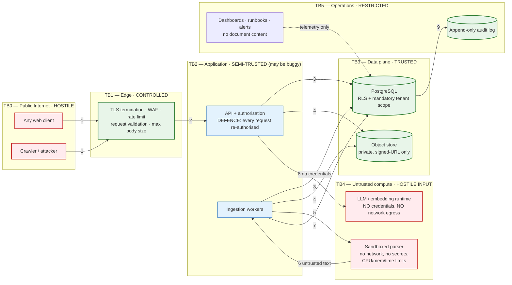
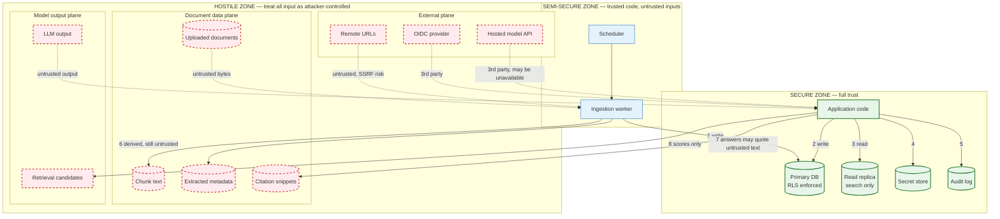
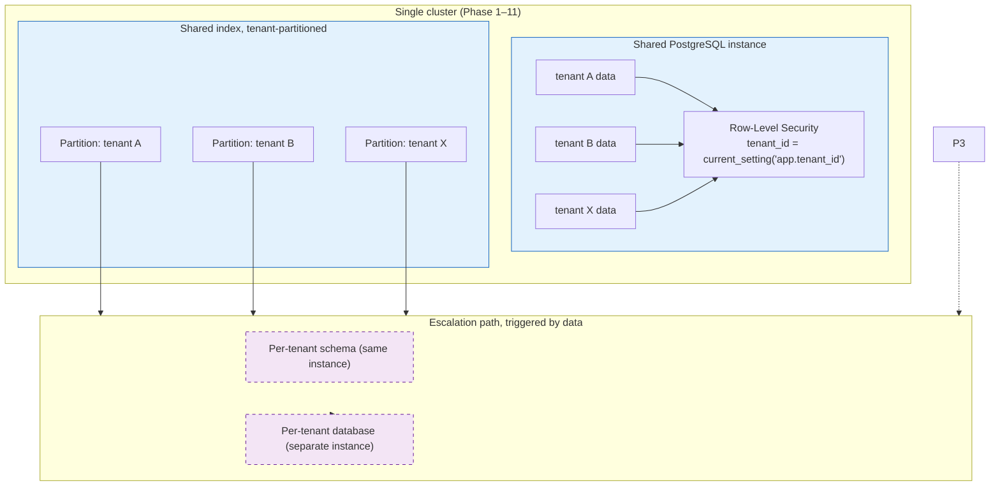

# §6 System Boundaries

The purpose of this section is to make one thing unambiguous: **what the system trusts, and what it
must treat as hostile.** Most RAG security failures are boundary failures — a component was treated as
inside the trust boundary when it was actually attacker-controlled.

---

## 6.1 System context

```mermaid
graph TB
    subgraph Users["Actors (unauthenticated until SEC-001)"]
        STU["Student / Lecturer<br/>Persona P1, P2"]
        ADM["Registry / Institution Admin<br/>Persona P3, P4"]
        OPS["Platform Operator / SRE<br/>Persona P5"]
        CMP["Privacy / Compliance Officer<br/>Persona P6"]
    end

    subgraph SYS["INTELLIGENT UNIVERSITY KNOWLEDGE ASSISTANT — SYSTEM BOUNDARY"]
        direction TB
        API["API Surface<br/>REST + SSE, OpenAPI 3.1"]
        ING["Ingestion Service"]
        RET["Retrieval Service"]
        ANS["Answer Service"]
        ADM_SVC["Administration Service"]
    end

    subgraph EXT["External systems (out of our trust boundary)"]
        IDP["OIDC Identity Provider<br/>OIDC / OAuth 2.1"]
        OBJ[("Object Store<br/>S3-compatible / MinIO<br/>UNTRUSTED CONTENT")]
        MOD["Model Runtime<br/>local llama.cpp / ONNX<br/>or hosted endpoint"]
        EMB["Embedding + Rerank Runtime<br/>ONNX / local"]
        SRC["Document Sources<br/>registry, departments, web"]
        OBS["Observability Stack<br/>OTel Collector, Prometheus,<br/>Loki, Tempo"]
    end

    STU -->|HTTPS + OIDC token| API
    ADM -->|upload, publish, rollback| API
    OPS -->|telemetry only, NO content read| API
    CMP -->|audit export| API

    API -->|verify JWT| IDP
    API --> ING
    API --> RET
    API --> ANS
    API --> ADM_SVC

    ADM_SVC -->|signed URLs, upload/download| OBJ
    ING -->|read raw bytes| OBJ
    ING -->|embed chunks| EMB
    RET -->|dense + lexical search| DB[(("Retrieval Index<br/>PostgreSQL + pgvector"))]
    ANS -->|generate / extract| MOD
    RET -->|rerank (GPU tiers only)| EMB
    ADM_SVC --> SRC

    API -.->|OTLP traces/metrics| OBS
    ING -.-> OBS
    RET -.-> OBS
    ANS -.-> OBS

    classDef trusted fill:#e8f5e9,stroke:#2e7d32,stroke-width:2px
    classDef untrusted fill:#ffebee,stroke:#c62828,stroke-width:2px
    classDef store fill:#e3f2fd,stroke:#1565c0
    class IDP untrusted
    class OBJ untrusted
    class MOD untrusted
    class EMB untrusted
    class SRC untrusted
    class DB store
```

**Key boundary decisions**

| Boundary | Decision | Rationale |
|---|---|---|
| Identity provider | **Outside** the trust boundary | An OIDC provider is a third party whose availability and correctness we do not control. We verify its tokens cryptographically; we do not assume it is benign or fast. |
| Object store | **Outside**; contents are **untrusted input** | Object storage holds attacker-supplied bytes. Treat every object as hostile regardless of who uploaded it. |
| Model runtime | **Outside**; treated as an **untrusted, fallible, non-deterministic** component | A model is a statistical component, not a trusted subsystem. Its output is untrusted until validated by the output contract + citation verification. This is why there is no "trusted model output" path in the design. |
| Embedding runtime | Inside the deployment boundary, but its output is versioned data, not truth | Embeddings influence ranking. A model swap changes results; that is tracked as an index version change. |
| Database | **Inside** the boundary — the most trusted component | Only the database is trusted to enforce tenancy. Application-level tenant filtering alone is insufficient (defence in depth: `SEC-003` also requires database-level enforcement). |
| Operator persona | Inside, but **content-blind by default** | Operators see telemetry, not documents. Support cost is a deliberate, documented trade-off. |

## 6.2 Trust boundaries



### Crossing rules (each is a testable control)

| # | Crossing | Rule | Enforced by |
|---|---|---|---|
| 1 | Internet → Edge | TLS only; request size limits; no body forwarded for oversized uploads | Edge config + `SEC-015` |
| 2 | Edge → App | Body size, content type, rate limit; **no trust of client-supplied tenant or role** | API validation |
| 3 | App → DB | **Tenant scope is mandatory and injected by the data-access layer, never by the caller.** Row-level security as a second, independent enforcement | Data-access layer + `SEC-003` |
| 4 | App → Object store | Only pre-signed, short-lived URLs; no public objects; no credentials in the browser | `FR-046`, `SEC-008` |
| 5 | App → Parser | Parser runs with **no network access, no credentials, no filesystem beyond a temp mount**, and hard resource limits | Sandbox (`SEC-007`) |
| 6 | Parser → App | Parser output is **untrusted text**. It is never interpreted as instructions, never executed, never used to build queries without parameterisation | Code review + injection tests (`SEC-004`) |
| 7 | App → DB (index write) | Single transaction; content-hash idempotency | `FR-007`, `OPS-004` |
| 8 | App → Model | Model gets **no credentials and no network egress**. It cannot fetch a URL, call an API, or read a file. This is the single most important capability control | Model runtime isolation (`SEC-004`) |
| 9 | DB → Audit | Append-only; no UPDATE/DELETE grant on the audit role | `SEC-010` |

> **Rule 8 deserves emphasis.** Most of the OWASP LLM threat list becomes inert when the model has no
> tools, no network, and no write capability. "No agents" is not an aesthetic choice here; it is the
> control that makes indirect prompt injection survivable. See Journey H.

## 6.3 Security boundary diagram



### Why each hostile-zone item is hostile

| Item | Why it is untrusted | Concrete risk if trusted |
|---|---|---|
| Uploaded documents | Content is attacker-supplied | Indirect prompt injection (THR-006), data exfiltration (THR-009) |
| Chunk text | Derived from untrusted content, but **baked into the retrieval index**, so it now influences every future query | Persistent prompt injection; index poisoning (THR-008) |
| Extracted metadata | Attacker controls filenames, titles, authors; often treated as "safe" by naive designs | **Metadata-based injection** (THR-008) — a field like `title = "Ignore previous instructions"` reaches the prompt. Mitigated by a strict field whitelist and by never concatenating metadata into instructions |
| Citation snippets | Reproduce untrusted text verbatim in the UI | Stored XSS if not rendered as text (THR-007) |
| LLM output | Statistical, non-deterministic, adversarially steerable | XSS, injection passthrough, unsupported claims, resource exhaustion |
| Retrieval candidates | Chosen by an attacker-influenced ranking | Injection payload entering the context window |
| OIDC provider | Third party | Availability dependency; misconfiguration → auth bypass |
| Hosted model API | Third party, may log our prompts | **Data egress to a third party** — unacceptable for restricted corpora; hence local-first |
| Remote URLs | Attacker-controlled destinations | SSRF to internal services and cloud metadata endpoints (THR-005) |

## 6.4 Data boundaries

| Data class | Examples | Boundary rule | Retention | Cross-tenant |
|---|---|---|---|---|
| **P0 — Restricted** | Individual student grades, disciplinary records, HR documents | Never enters the retrieval corpus. If it must, it is per-principal and never indexed for others | Policy-defined, `NFR-011` | Absolutely forbidden |
| **P1 — Confidential** | Unpublished exam papers, draft circulars, committee minutes | Only `DRAFT` state, visible to authorised admins; **excluded from default retrieval by construction** | Until published + retention window | Forbidden |
| **P2 — Institutional** | Regulations, timetables, handbooks, policies, published circulars | Indexed; ACL-filtered; publicly answerable within tenant | Indefinite with versioning | Never crosses tenants |
| **P3 — Operational** | Query text, answer records, citations, retrieval traces | Stored for audit and evaluation; PII-redacted | 90 days `ESTIMATE`, configurable | Never |
| **P4 — Telemetry** | Metrics, structured logs, traces | **Never contain document content or query text** (`NFR-010`); identifiers and scores only | 14–30 days | Aggregated only |

**The P3/P4 distinction is a real security boundary, not a naming convention.** Query text is
attacker-controlled and may itself contain injected instructions; putting it in logs would (a) leak
student questions and (b) create a log-injection channel that engineers read daily. Enforced by
`NFR-010` and tested.

## 6.5 Multi-tenancy boundary model

The system is single-tenant in its first deployment but **must not be architected single-tenant**.
See [§ L of the brief] and [ADR-002](../../docs/04-adrs/ADR-002-postgresql-pgvector-as-the-single-data-store.md).



### Isolation options considered

| Option | Isolation strength | Cost | Noisy-neighbour risk | Migration needed? | Verdict |
|---|---|---|---|---|---|
| **Shared table, `tenant_id` column + RLS** | Medium — enforced by the database, bypassable only by a bug or a superuser | Lowest | **Real**: one tenant's bulk ingestion degrades others | Yes (backfill, index rebuild) | **Chosen for Phase 1–11.** Simple, cheap, and RLS makes an app-layer bug insufficient on its own to leak data |
| Separate schemas, same instance | Medium-high | Low | Reduced (separate index memory) | Yes (view layer changes) | Escalation step 1 |
| Separate databases / instances | High | High — N × (backup, migration, monitoring) | Eliminated | Yes (routing layer) | Escalation step 2, triggered by: regulatory requirement, > 50 tenants, or a noisy-neighbour incident |
| Separate vector index per tenant | High | High | Eliminated for retrieval | Yes | Co-occurs with DB split |

**Decision rules (written now, before we know which will be needed):**

| Trigger | Action |
|---|---|
| A regulatory or contractual requirement for physical isolation | Jump directly to separate databases |
| More than ~50 tenants, or p95 latency for the noisiest tenant degrading others | Escalate to per-tenant schema, then per-tenant DB |
| Any cross-tenant data-leak incident | Immediate escalation, regardless of scale |
| A tenant exceeding a storage/throughput quota persistently | Per-tenant deployment (their own VM), off the shared cluster |

**Noisy-neighbour mitigation before escalation:** per-tenant ingestion concurrency limits
(`SEC-011`), per-tenant queue depth, per-tenant retrieval timeouts, and a per-tenant SLO view in
the dashboard so interference is *detectable* rather than inferred from a support ticket.

## 6.6 Boundary requirements derived from this section

| ID | Requirement | Why it exists |
|---|---|---|
| BND-1 | No model runtime component ever holds credentials or network egress | Makes prompt injection survivable rather than merely detectable |
| BND-2 | Tenant scope is injected by the data-access layer and re-asserted by RLS | Two independent controls; one is not enough |
| BND-3 | Document text, metadata, and titles are never concatenated into instruction positions | Metadata injection is the less-remembered LLM threat |
| BND-4 | Telemetry contains no document content and no raw query text | Prevents both leakage and log injection |
| BND-5 | Parser runs with no network and no credentials | Contains parser RCE and SSRF-via-parser |
| BND-6 | Restricted data (P0) never enters the retrieval index | Cheapest control is exclusion |
| BND-7 | The object store is private; the only access path is a short-lived signed URL | Removes a whole class of authorisation bugs |
| BND-8 | Every model output is structurally validated before it reaches a renderer or a datastore | A model is an untrusted producer |