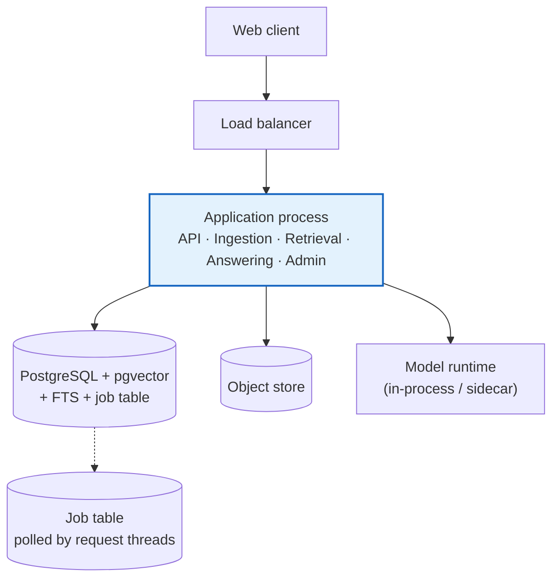
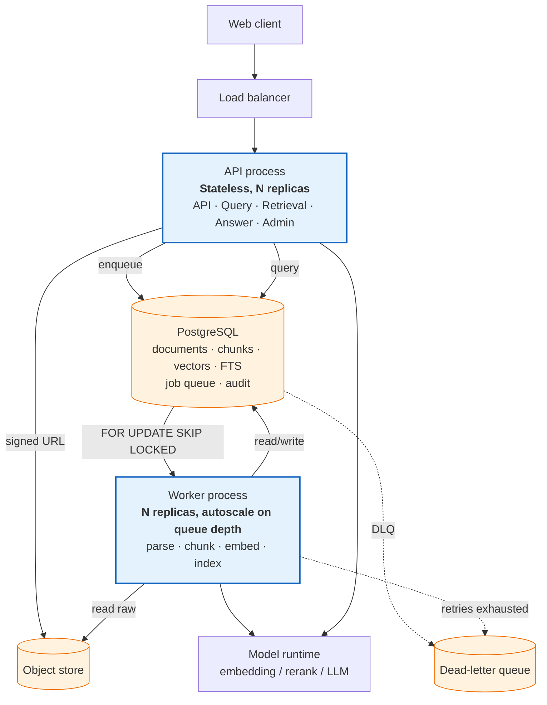
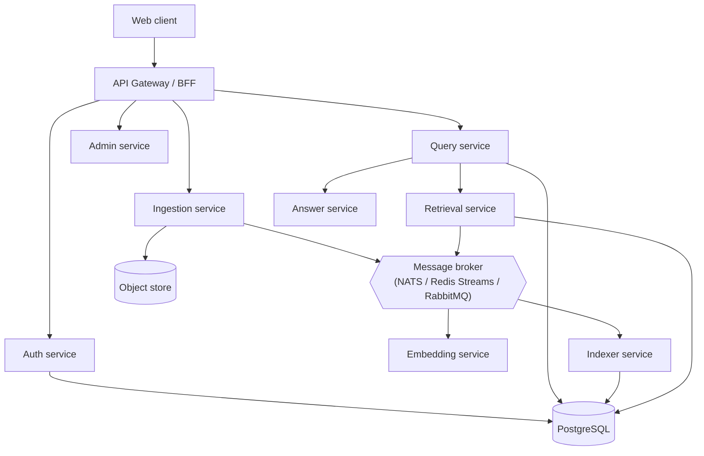
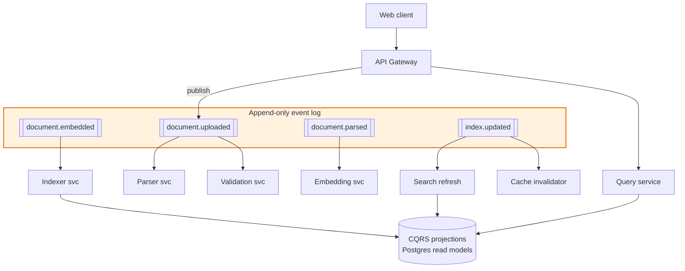

# §7 Initial Architecture Options

Four topologies were considered. They are not strawmen: each is a defensible choice that a strong team
would arrive at, and the analysis is written to make the *rejection* of C and D as rigorous as the
selection of B.

Every option is evaluated against the same twelve fitness dimensions from principle **V**, plus the
requirement IDs it serves.

| # | Option | One-line description |
|---|---|---|
| [A](#71-option-a--synchronous-modular-monolith) | Synchronous modular monolith | One process, request-time ingestion, no queue |
| [B](#72-option-b--modular-monolith-with-asynchronous-workers) | Modular monolith + async workers | One codebase, two process roles, Postgres-backed queue |
| [C](#73-option-c--service-oriented-architecture) | Service-oriented | Independent deployables over HTTP/gRPC |
| [D](#74-option-d--event-driven-service-architecture) | Event-driven services | Kafka/Redpanda-first, CQRS, eventual consistency |

---

## 7.1 Option A — Synchronous Modular Monolith



**Components.** Single deployable. Strict internal module boundaries (domain / application /
infrastructure). Ingestion runs synchronously in the request or in a request-scoped task.

**Data flow.** Upload → parse → chunk → embed → index → respond. All inside one request lifecycle.

### Advantages

- **Lowest operational surface by far.** One thing to deploy, monitor, back up, and secure.
- **Easiest to reason about**: no partial failures across services, no distributed transactions, no
  network hops in the critical path.
- **Cheapest**: one process, one database, no inter-service traffic.
- **Fastest to build** and fastest for a developer to debug with a single-threaded request.
- Genuinely sufficient for the *query* path: retrieval at ~200 ms does not benefit from being split.

### Disadvantages

- **Ingestion blocks.** A 25 MB PDF takes minutes (parse + embed). Holding a request open for that
  violates PERF-005 (< 120 s p95) and exhausts the connection pool under batch import.
- **Resource asymmetry is invisible.** Generation wants GPU; serving wants CPU; ingestion wants
  burst CPU and lots of RAM for parsing. One process means one scaling policy for three conflicting
  workloads.
- **A malformed document can exhaust the process.** Parser memory blowups take down serving.
- **No natural backpressure.** Without a queue, concurrency limits are the only defence.

### Fitness (1–5)

| Dimension | Score | Reason |
|---|---|---|
| Scalability | 2 | Ingestion and serving cannot scale independently |
| Reliability | 3 | Few failure modes, but parser failures become serving failures |
| Performance | 4 | Lowest overhead; optimal for the query path |
| Security | 3 | One trust boundary to police, but the parser runs in-process with DB credentials |
| Cost | 5 | Cheapest possible |
| Operability | 3 | Simple to run, hard to scale or isolate |
| Maintainability | 5 | Single codebase, one deploy, trivial local dev |
| Dev complexity | 5 | Lowest cognitive load |
| Migration path | 3 | Splitting later is possible but requires reintroducing all the seams |
| Free-tier fit | 5 | Runs on a 1 GB VM |

**Blocking requirement failures:** PERF-005 (freshness under batch), PERF-006 (ingestion throughput),
OPS-005 (DLQ), OPS-006 (timeouts without queueing), NFR-007 (backpressure), and the parser-isolation
control of SEC-007.

---

## 7.2 Option B — Modular Monolith with Asynchronous Workers

> **This is the recommended option.** Selection rationale, the weighted matrix and the sensitivity
> analysis are in [§8](07-decision-matrix.md); the full chosen design is in [§9](08-recommended-architecture.md).



**Components.** One repository, one database. Two **process roles** from the same codebase:
`api` (stateless request serving) and `worker` (asynchronous ingestion). Both hold no authority that
the other lacks; they differ in scaling policy and resource profile, not in trust.

**Data flow.**

```
Upload ──signed URL──▶ object store
        └──enqueue──▶ job table
                        │  worker claims with FOR UPDATE SKIP LOCKED
                        ▼
        validate ▸ sandbox-parse ▸ structure ▸ normalise ▸ chunk ▸ embed ▸ index ▸ (publish)
                        │
                        └── failure ─▶ retry w/ backoff ─▶ DLQ ─▶ quarantine
Query  ─▶ api: authz ▸ embed ▸ hybrid retrieve ▸ rerank ▸ assemble ▸ answer ▸ verify ▸ persist
```

### Advantages

- **Ingestion is off the request path**: PARSE/EMBED failures cannot degrade query latency.
- **Independent scaling**: N API replicas for read traffic, M workers for burst ingestion, chosen from
  the same image and config. Worker count scales to zero when the queue drains.
- **Resource isolation**: the parser runs in a sandboxed subprocess with no DB credentials, satisfying
  SEC-007 properly rather than nominally.
- **Backpressure is explicit**: bounded queue, visible depth, `Retry-After` when full (NFR-007).
- **At-least-once delivery is handled**: content-hash idempotency makes redelivery a no-op (OPS-004).
- **Degradation is real**: query serving needs neither the queue nor the workers. Worker death does not
  affect queries; this is Journey I/J.
- **Still one codebase and one database**: no distributed transactions, no service-to-service auth, no
  version-skew bugs.
- **Cheapest option that satisfies every requirement** — same host, ~2 processes.

### Disadvantages

- **The database is a coupled dependency and a shared bottleneck.** Heavy ingestion (write-heavy,
  index-building) can degrade query latency via I/O and locks. Requires deliberate isolation:
  separate connection pools, `statement_timeout`, autovac tuning, and reading queries from a replica
  when load warrants.
- **Postgres-as-queue has a throughput ceiling** (~1–5 k jobs/s, far above our needs of 10/s) and
  needs careful index hygiene (`SKIP LOCKED` + partial index on unclaimed rows) or it degrades under
  poll churn.
- **HNSW index build competes with serving.** This is the sharpest edge of Option B: building an
  ANN index for 22 M chunks is CPU- and I/O-heavy. Mitigated by building a **shadow index and swapping
  atomically** (FR-014), never `REINDEX` in place.
- **Deployment still ships both roles**, so a worker bug can restart the API. Mitigated by
  independent process supervision and by API↔worker version skew being tolerated (queue payloads are
  versioned).
- **Two failure modes instead of one** — a genuinely different reliability profile from A.

### Fitness (1–5)

| Dimension | Score | Reason |
|---|---|---|
| Scalability | 4 | Horizontal on both roles; single-node limit ~10⁸ chunks, mitigated by partitioning |
| Reliability | 5 | Failure isolation between read and write paths; explicit DLQ |
| Performance | 5 | Query path identical to A; ingestion no longer contends |
| Security | 4 | Parser isolated; DB still a single trust domain |
| Cost | 5 | Still a single small host; workers scale to zero |
| Operability | 4 | Two roles to understand; one stack to run |
| Maintainability | 4 | Module boundaries need enforcement, but no network boundaries |
| Dev complexity | 4 | Moderate; queues introduce concurrency reasoning |
| Migration path | 5 | Extract a worker or API to a service later; the seam already exists |
| Free-tier fit | 5 | 1 process on a 1–2 GB VM |

**Requirement coverage:** satisfies every MUST requirement, including the ones Option A fails.

---

## 7.3 Option C — Service-Oriented Architecture



**Components.** Independently deployable services: auth, query, ingestion, admin, retrieval, answer,
embedding, indexer. A broker for async fan-out. Potentially one database per service.

### Advantages

- **True independent scaling** of each workload, including separately-priced GPUs for embedding.
- **Strong fault containment** via bulkheads and per-service circuit breakers.
- **Team autonomy** — the real driver of this pattern at scale. *We have one team.*
- **Technology per service**: a Python embedding worker and a Go query service can coexist naturally.
- **Per-service SLOs and scaling policies** are directly expressible.
- Per-service deploy cadence and blast radius control.

### Disadvantages

- **Operational cost is the dominant negative.** ~8 deployables × (CI, versioning, on-call runbooks,
  dashboards, capacity planning, dependency upgrades, security patching). On a free tier this is
  simply unaffordable in *attention*, which is our scarcest resource.
- **Distributed transactions.** An "upload document" flow spans 3–4 services. Postgres-as-one-database
  gives us ACID across the whole domain; splitting it means saga/compensation logic, and
  **partial-failure states become the normal case, not the exception.**
- **Network hops on the critical path.** Query latency budget is ~5.7 s total with a ~200 ms
  retrieval budget; 4 extra service hops at ~5–20 ms each, plus serialisation, plus tail latency from
  unrelated deployments, all land in the budget we care about most.
- **Observability tax.** Cross-service correlation must be perfect or debugging is guesswork.
  This is achievable (OpenTelemetry) but is a *real, permanent* cost, not a one-time setup.
- **Free-tier resource limits do not permit the topology's benefit to materialise.** A 4 GB ARM VM
  cannot usefully host 8 services; you get 8 throttled processes plus 8× the memory overhead.
- **Premature**: there is no organisational pain this solves at Phase 1–9.

### Fitness (1–5)

| Dimension | Score | Reason |
|---|---|---|
| Scalability | 5 | Best possible horizontal scaling |
| Reliability | 3 | Isolation improves; partial failures and retries worsen net reliability |
| Performance | 4 | Good, but network overhead eats the latency budget |
| Security | 4 | Strong per-service boundaries; more surface and more auth surface |
| Cost | 2 | Infrastructure is affordable; **human/operational cost is not** |
| Operability | 2 | Worst: many runbooks, many failure modes |
| Maintainability | 3 | Good at team scale, worse at solo scale |
| Dev complexity | 2 | Significant |
| Migration path | 5 | Already distributed |
| Free-tier fit | 2 | Does not fit memory/CPU budget |

---

## 7.4 Option D — Event-Driven Service Architecture



**Components.** Broker-first (Kafka/Redpanda), event-sourced aggregates, CQRS projections, eventual
consistency everywhere, sagas for multi-step workflows.

### Advantages

- **Excellent replay and auditability** — a genuine fit for a system where "what did the index
  contain on 3 March?" must be answerable.
- **Natural backpressure** via consumer lag; durable buffering absorbs ingestion bursts.
- **Extensible**: many downstream consumers can be added without touching producers.
- **Very high throughput ingestion.**
- The event log is an attractive long-term archive for evaluation dataset construction.

### Disadvantages

- **Eventual consistency is a poor default for a system whose core promise is "the answer reflects
  the current policy".** Journey E's atomic version switch and Journey F's purge both demand
  strong consistency. Eventual consistency would mean users can be shown a superseded rule.
- **Operational weight is the highest of the four.** Broker partition rebalancing, consumer lag
  alerts, offset management, schema registry, idempotent consumers everywhere — on a free tier.
- **Exactly-once is a myth.** At-least-once + idempotency is achievable; believing otherwise is a
  classic source of duplicate documents and duplicate charges.
- **Two write models** (event log + projections) means two places for state to be wrong, and a
  reconciliation mechanism to run forever.
- **Traceability becomes narrative**: "why is this chunk missing?" is answered by replaying events,
  not by reading a row.
- **Schema evolution** is a permanent operational tax.
- **Cost and complexity are wildly disproportionate to the problem.**

### Fitness (1–5)

| Dimension | Score | Reason |
|---|---|---|
| Scalability | 5 | Highest ceiling |
| Reliability | 4 | Durable buffering is excellent; consistency bugs replace failures |
| Performance | 4 | High throughput; projection lag hurts read freshness |
| Security | 4 | Good audit story; events are a new leakage surface |
| Cost | 2 | Broker + projections + schema registry |
| Operability | 1 | Hardest to operate of the four |
| Maintainability | 3 | Powerful, high cognitive load |
| Dev complexity | 1 | Highest |
| Migration path | 4 | Can adopt parts later (outbox pattern, CDC) |
| Free-tier fit | 2 | Not viable |

---

## 7.5 Side-by-side summary

| Dimension | A: Sync monolith | **B: Monolith + workers** | C: Service-oriented | D: Event-driven |
|---|---:|---:|---:|---:|
| Scalability | 2 | **4** | 5 | 5 |
| Reliability | 3 | **5** | 3 | 4 |
| Performance | 4 | **5** | 4 | 4 |
| Security | 3 | **4** | 4 | 4 |
| Cost (total, incl. attention) | 5 | **5** | 2 | 2 |
| Operability | 3 | **4** | 2 | 1 |
| Maintainability | 5 | **4** | 3 | 3 |
| Developer complexity | 5 | **4** | 2 | 1 |
| Free-tier feasibility | 5 | **5** | 2 | 2 |
| Migration path | 3 | **5** | 5 | 4 |
| **Simple weighted score** | **3.55** | **4.43** | **3.28** | **3.17** |

Formal weighting, rationale and sensitivity analysis: [§8](07-decision-matrix.md).

## 7.6 Why four options and not more

Options considered and **not** modelled separately, with reasons:

| Considered | Why not a distinct option |
|---|---|
| Serverless / functions | Same topology as B with a different packaging. Worth revisiting for the GPU embedding burst path (`OQ-006`); not a system architecture choice now. |
| Microservices with per-service databases | A variant of C. Modelled as part of C's cost profile. |
| Event sourcing without a broker | Captured by the outbox pattern inside B (see [ADR-001](../../docs/04-adrs/ADR-001-modular-monolith-with-asynchronous-workers.md)). |
| Elasticsearch/OpenSearch instead of Postgres FTS | A component choice, not a topology. Evaluated in [§10](09-technology-evaluation.md#104-search-component-lexical-leg). |
| Client-side / edge RAG | Rejected on principle: document content would be shipped to clients, and per-user authorisation filtering would be lost. |

## 7.7 What would change the answer

Option B is a bet on *current* scale. These are the conditions that should trigger re-evaluation,
recorded now so the trigger is not a matter of memory later:

| Trigger | Move to |
|---|---|
| > 10⁸ chunks, or p95 latency degrading from index size | **C** (extract Retrieval + Embedding services first) |
| A second team owning ingestion | **C** (extract Ingestion first) |
| Sustained > 100 QPS, or serving needs GPU while ingestion needs CPU burst | **C** |
| Guaranteed multi-region active-active, or cross-service auditability becomes mandatory | **D**, entering via the outbox pattern |
| Regulatory requirement for physically isolated tenants | **C** with per-tenant databases |
| External consumers need to subscribe to document events | **D**, via a CDC/outbox feed from B |

None of these are expected within Phases 1–11. All of them are *compatible with B*, because B already
has the seams (separate process roles, an explicit queue, a port-isolated model layer).
**Choosing B is a decision to keep the seams, not a decision to stay small forever.**