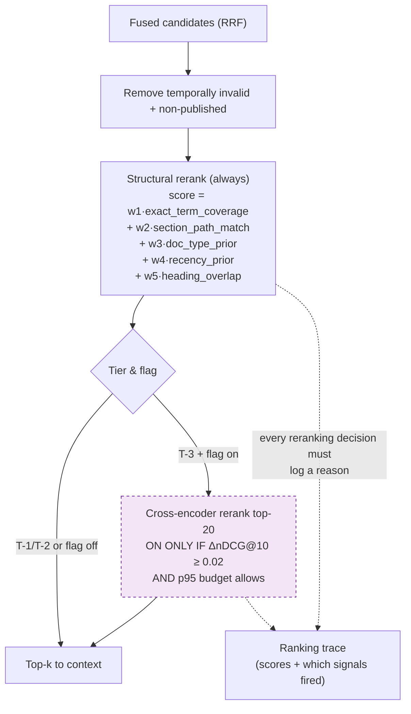
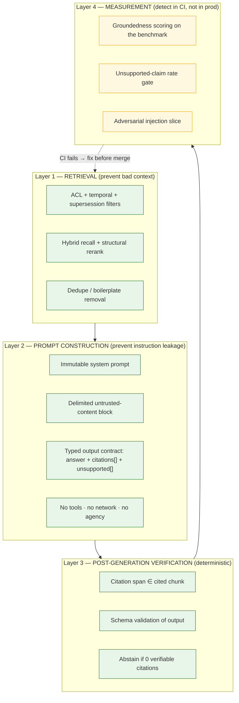

# §11 RAG Architecture Options

**Principle.** Do not implement advanced techniques because they exist. Each technique below gets a
**justification test** — a measurement that must be met before it is admitted to the default path.
Techniques that fail their test ship as flag-gated features or are rejected.

The default pipeline is deliberately small:

```
question → normalise → [ACL + temporal filter] → lexical ∥ dense → RRF
          → structural rerank → dedupe → context assembly → extractive answer → citation verify
          → (optional, flag-gated) generative answer
```

---

## 11.1 Technique assessment

| # | Technique | Why it might help | Why it might not | Justification test | **Decision** |
|---|---|---|---|---|---|
| T1 | **Lexical search (BM25/FTS)** | Exact terms: regulation numbers, dates, course codes, "10%" | Fails on paraphrase ("sick leave" vs "medical absence") | Baseline; must exist — the dense leg cannot match exact identifiers | **ADOPT — always** |
| T2 | **Dense (vector) search** | Paraphrase, synonyms, cross-lingual | Loses exact identifiers; hallucinated nearest neighbours | Must beat T1 on the paraphrase slice by ΔRecall@10 ≥ 0.05 | **ADOPT — always** |
| T3 | **Hybrid + RRF fusion** | Gets both failure modes covered | Fusion can dilute a strong signal | Hybrid ≥ max(T1, T2) on nDCG@10 for the *overall* benchmark | **ADOPT — default** |
| T4 | **Cross-encoder reranking** | True query–passage interaction; the standard fix for ANN recall loss | 33 s/query on CPU ([§4.4](03-scale-model.md#44-reranking--infeasible-on-cpu-so-it-is-not-a-default)); risk of overfitting to one query style | ΔnDCG@10 ≥ 0.02 **and** ΔRecall@20 ≥ 0.01 **and** p95 +250 ms | **REJECT as default. ADOPT flag-gated on GPU tiers only.** |
| T4b | **Structural/lexical reranking** | Exact-term coverage, section-path match, doc-type/recency priors | Shallow semantics | Must not reduce nDCG@10 | **ADOPT — always, as the default ranker** |
| T5 | **Query rewriting** | Fixes vocabulary mismatch, coreference ("it", "that module") | Can destroy intent; adds a model call and latency | ΔnDCG@10 ≥ 0.02 on the rewrite slice | **FLAG-GATED, off by default** |
| T6 | **Query decomposition** | Multi-hop questions (Journey B) | Decomposition quality is model-dependent; adds latency; can answer only part 1 | ΔnDCG@10 ≥ 0.02 on the multi-hop slice | **FLAG-GATED, off by default** |
| T7 | **Metadata filtering** | Enforces ACLs, effective dates, department scope; big precision win | Requires good metadata; over-filtering recalls nothing | Mandatory for **security** (not quality); quality gain measured | **ADOPT — mandatory**, pushed into the index scan |
| T8 | **Semantic chunking** (embedding-boundary detection) | Respects topic boundaries better than fixed windows | Requires a full-corpus pass; non-deterministic unless seeded; ~3–5× embedding cost | ΔRecall@10 ≥ 0.02 **and** embedding cost within the freshness budget | **REJECT initially.** Adopt only if fixed-window chunking underperforms on the structure-heavy slice |
| T9 | **Hierarchical / parent-child retrieval** | Retrieve a small child, cite with the parent section; better context coherence | Extra index; more moving parts; risk of retrieving a child from an irrelevant parent | ΔnDCG@10 ≥ 0.02 on the structure-heavy slice | **PARTIAL — parent section *context enrichment* only** (cheap, no second index). Full hierarchy deferred |
| T10 | **Context compression** | Fits more evidence in budget | Can drop the clause that matters; needs an extra model call | ΔRecall@10 ≥ 0.02 at equal context size | **REJECT initially** |
| T11 | **Hybrid chunking: heading-aware + window** | Sections are natural boundaries in policy docs | Slightly worse recall than pure sliding windows for unheaded docs | Measured on the benchmark; used only within a heading section | **ADOPT** — structural chunks, with a window fallback inside a section |
| T12 | **Deduplication / near-duplicate removal** | Boilerplate swamps context | Removes genuinely repeated rules | Boilerplate share of context < 10 % | **ADOPT — always** |
| T13 | **Answer caching** | Repeated policy questions are the dominant query shape | ACL/staleness risk | Cache hit rate ≥ 30 %, zero cross-ACL leakage (tested) | **ADOPT** with `acl_set_hash` in the key |
| T14 | **Answer abstention** | The core correctness property | Over-abstention hurts UX | ≥ 90 % correct abstention, ≤ 5 % unsupported claims on the absent slice | **ADOPT — mandatory** |
| T15 | **Citation verification (deterministic span check)** | Catches fabricated quotes at zero cost | Cannot catch a fluent uncited claim | Citation correctness ≥ 0.97 | **ADOPT — mandatory** |
| T16 | **Groundedness judging (model-based)** | Catches uncited unsupported claims | An LLM judge is itself a model; needs pinning and calibration | Correlates ≥ 0.8 with human labels on a 200-answer sample | **MEASUREMENT ONLY** — in the benchmark, never in the request path |
| T17 | **Multi-vector / late interaction (ColBERT-style)** | Better matching than single-vector | Requires a different index; complex; heavy | ΔRecall@10 ≥ 0.05 vs single-vector at equal latency | **REJECT** — pgvector cannot express it; would break the one-engine decision |
| T18 | **Graph / entity retrieval** | Handles entities that span documents (a course ↔ module ↔ exam board) | Ontology engineering is a project in itself; error-prone | Requires a corpus with genuinely cross-document structure | **REJECT** — YAGNI. Structured entities handled relationally instead ([§9.6]) |
| T19 | **Fine-tuning / LoRA adapters** | Domain adaptation | No requirement; needs data we do not have; adds GPU cost | — | **REJECT — not planned** |
| T20 | **Two-stage retrieval (coarse→fine)** | Cost control | Our corpus fits in one stage | — | **REJECT — unnecessary complexity** |

### Summary of admitted vs rejected

| Status | Techniques |
|---|---|
| **Always on (default path)** | T1, T2, T3, T4b, T7, T11, T12, T13, T14, T15 |
| **Flag-gated, off by default** | T4 (GPU only), T5, T6, T9-full |
| **Measurement-only** | T16 |
| **Rejected, revisit on trigger** | T8, T10, T17, T18 |
| **Rejected, not planned** | T19, T20 |

**Nine of twenty techniques are in the default path.** That is the discipline this project is claiming:
the pipeline is not a checklist of RAG features, it is the smallest set that the benchmark supports.

---

## 11.2 Chunking — the decision with the most downstream consequence

### Requirements a chunking strategy must satisfy

| # | Requirement | Consequence if violated |
|---|---|---|
| C1 | **Chunk fits the embedding model's context window** | Tail silently unembedded → unretrievable content. With 512-token models, chunk ≤ 450 tokens |
| C2 | Chunk is **self-contained** for answering | Answers that cite fragments nobody can interpret |
| C3 | Chunk boundaries **respect document structure** | Citations point at arbitrary mid-paragraph offsets |
| C4 | Chunks are **stable** for a given (document version, chunking version) | Index diffs become meaningless; idempotency breaks |
| C5 | Overlap prevents **boundary loss** | The sentence spanning a boundary is lost |
| C6 | **Cheap** — no extra model pass over the corpus | Ingestion cost multiplies |

### Chosen strategy

```
Structural chunking (heading-aware) with a sliding-window fallback inside a section.

1. Parse to a tree of sections (heading level → path, e.g. "4.2 Attendance > 4.2.1 Penalties")
2. Within each section, emit windows of 400 tokens with 50-token overlap
3. Never emit a chunk that spans two top-level sections (citation clarity)
4. Each chunk carries: {section_path, page_range, doc_type, effective_from/to,
                        content_hash, chunker_version, embedding_model_id}
5. Deterministic: identical input + identical version → identical chunk IDs
```

| Parameter | Value | Reason |
|---|---|---|
| Chunk size | 400 tokens | Fits a 512-token encoder (C1) with headroom for special tokens |
| Overlap | 50 tokens (12.5 %) | Enough to prevent boundary loss; more wastes context |
| Minimum chunk | 60 tokens | Merges fragments into their parent section (avoids orphan citations) |
| Unit | Heading-aware section | Citations name a clause, not an offset (C3) |
| `chunker_version` | Semver, stored per chunk | Changing it forces reindex (FR-013) |

**Chunk size is a coupled triple:** chunk size ↔ embedding context window ↔ context token budget ↔
reranker cost. Changing any one forces evaluation of the others. This coupling is recorded explicitly
because it is the most common silent source of RAG quality regression.

### Why not larger chunks (800–1,000 tokens)?

Better context coherence — but it silently truncates on 512-token encoders (C1). If a longer-context
model (`bge-m3`, 8192) is adopted on a GPU tier, chunk size can rise to ~800 and **must** be
re-benchmarked, because larger chunks change the recall/precision trade-off and increase per-chunk
rerank cost by 2×.

### Why not semantic chunking?

T8 is rejected pending measurement. The honest reason is cost: embedding the corpus twice (once to find
boundaries, once to embed chunks) doubles the dominant ingestion cost, and on CPU that cost is already
the binding constraint ([§4.3](03-scale-model.md#43-embedding-throughput--the-real-constraint)). If
Phase 7 shows the structure-heavy slice underperforms, semantic chunking is reconsidered as a
flag-gated chunker behind the same `ChunkerPort`.

---

## 11.3 Metadata schema (what the filter uses)

| Field | Type | Used for | Extracted by | Trust |
|---|---|---|---|---|
| `tenant_id` | uuid | **Isolation** | System | Trusted |
| `doc_id`, `version_id` | uuid | Citations, lineage | System | Trusted |
| `status` | enum | PUBLISHED filter | Workflow | Trusted |
| `effective_from` / `effective_to` | timestamptz | Temporal filter, as-of | Metadata extraction | **Semi-trusted** (admin-supplied; validated) |
| `superseded_by` | uuid | Exclude superseded | Workflow | Trusted |
| `doc_type` | enum | Type priors, filtering | Metadata extraction | Semi-trusted |
| `department` / `faculty` | text | Scope filter, routing | Metadata extraction | Semi-trusted |
| `section_path` | text[] | Citation display, structural rerank | Parser | Trusted (derived) |
| `page_range` | int2[] | Citation precision | Parser | Trusted |
| `acl_principals` | text[] | **Authorisation filter** | ACL service | **Trusted — computed, never client-supplied** |
| `language` | text | Language config, metrics | Detector | Semi-trusted |
| `content_hash` | text | Idempotency, diffing | System | Trusted |
| `chunker_version` / `parser_version` / `embedding_model_id` | text | Reproducibility, reindex | System | Trusted |
| `title`, `author` | text | Display, boosting | Metadata extraction | **UNTRUSTED — never used in instructions** |

**The `acl_principals` rule is the security-critical one.** It is computed by the authorisation layer
from the document's ACL rows, denormalised onto the chunk for filter performance, and refreshed
whenever an ACL changes. It is never accepted from an uploader, never derived from document content,
and never read from the LLM. An error here is a data breach, which is why it has a dedicated negative
test suite ([ADR-007](../../docs/04-adrs/ADR-007-authorisation-enforced-at-the-retrieval-layer.md)).

**The metadata-injection rule is separate and equally strict:** untrusted metadata (`title`, `author`,
`section_path`) may be used for **filtering, boosting and display**, and must never be concatenated
into a prompt position where it could read as an instruction ([BND-3](05-system-boundaries.md)).

---

## 11.4 Reranking policy



**Rules:**

1. The structural reranker is **explainable** — it records which signals fired. This matters for
   debugging "why did this wrong document win?" and for the support workflow.
2. The cross-encoder is **flag-gated per tenant and per tier**, and its enablement decision is recorded
   in the engineering journal with the measured ΔnDCG.
3. Every reranking decision is observable (ranking trace), so the next design change is driven by data
   rather than intuition.
4. **No reranker is applied after generation.** Ordering happens before context assembly, always.

---

## 11.5 Context assembly

| Rule | Rationale |
|---|---|
| Hard token budget (configurable per tenant, default 2,000) | Latency and cost control; PERF-004 |
| Truncate at **section boundaries**, never mid-clause | A citation that points at a broken sentence is unhelpful |
| **Report truncation** in response metadata | Silent truncation hides evidence from the user ([FR-030]) |
| Group by source document; label each group | Helps the model attribute; helps the user verify |
| Include `section_path` + `effective_from` in each block | Citation generation is nearly free and always more precise |
| Deduplicate near-identical chunks first | Boilerplate wastes budget and confuses ranking |
| Include a **coverage note** when multiple sub-questions are detected | Journey B honesty |
| Never include chunks that failed ACL filtering | Non-negotiable; enforced upstream |

---

## 11.6 Generation and hallucination control — defence in depth

Five independent layers. Each catches a class the others do not.



**Why layer 4 is CI-only and not a request-path check:** a groundedness model in the request path
doubles latency and is itself a non-deterministic component, so it cannot be a reliable safety control.
It is an excellent *measurement* instrument. Using a measuring instrument as a safety mechanism is a
category error — and it is a mistake we can avoid for free.

---

## 11.7 Multi-source answers and conflict handling

| Situation | Behaviour | Rationale |
|---|---|---|
| One source suffices | Single answer, single citation | Simplicity |
| Several sources, consistent | Merged answer, per-claim citations | Normal multi-hop case |
| Sources **conflict** | Present both with effective dates; state the conflict; **do not adjudicate** | The LLM has no authority to resolve policy. This is a human decision |
| Same document, two versions in scope | Default: current version only; old version linked as history | FR-009 |
| Overlapping effective windows | Both returned + admin alert (data error) | Never silently pick |
| One source, weak support | Answer with a **confidence caveat** naming the weakness | Better than false confidence |
| No source | Abstain (Journey C) | Core correctness property |

Conflict detection is a deterministic pre-check (two high-scoring candidates from different documents
whose extracted claims share entities and opposing modality), not a model judgement. It can be wrong in
either direction; it is tuned for **recall of conflicts** (better to surface a non-conflict than to
silently hide a real one).

---

## 11.8 What "good enough" means, numerically

Targets for the benchmark, established **before** implementation so that success is not defined
after the fact:

| Metric | Target | Applies to |
|---|---|---|
| Recall@10 (hybrid) | ≥ 0.90 overall | Default path |
| Recall@20 (hybrid, no rerank) | ≥ 0.95 overall | Free tiers |
| nDCG@10 | ≥ 0.80 overall | Default path |
| MRR@10 | ≥ 0.85 | Default path |
| Answer exact/substance correct | ≥ 0.85 | In-corpus slice |
| Citation correctness | ≥ 0.97 | All slices |
| Groundedness | ≥ 0.95 | In-corpus slice |
| Unsupported-claim rate | ≤ 0.02 in-corpus, ≤ 0.05 absent-slice | All |
| Correct abstention (absent slice) | ≥ 0.90 | Absent slice |
| Citation resolution success | 1.00 | All |
| p95 search latency | < 500 ms (T-2) | System |
| p95 extractive answer latency | < 900 ms (T-2) | System |

**These are commitments, not aspirations.** Phase 12 will report before/after for every change that
touches them, and a regression beyond the tolerance in [§12](11-rag-quality-strategy.md) blocks the
merge.