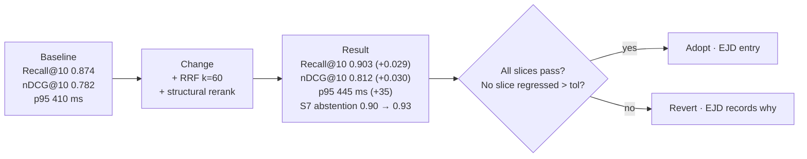

# §12 RAG Quality Strategy

**Principle.** Evaluation is a *deliverable*, not a report at the end. If quality is not measured in
CI on every change, "it seems to work" is the only available statement, and no optimisation can be
justified.

---

## 12.1 The evaluation problem, stated honestly

The hardest constraint on this project is **evaluation, not engineering**. We have no production
traffic, no user queries, and institutional documents may be confidential. Therefore:

| Problem | Consequence |
|---|---|
| No real user queries | We must author the question set. Author-written questions are biased toward what the author could find |
| No gold-standard relevance labels | Retrieval metrics require *per-chunk relevance judgements*, which are expensive to produce |
| No real corpus (possibly confidential) | Benchmark corpus must be synthetic or public |
| LLM-as-judge is non-deterministic | Judgement must be pinned, calibrated against humans, and versioned |

**Mitigation, in order of trustworthiness:**

1. **Prefer deterministic metrics.** Citation correctness, abstention behaviour, latency, and lexical
   overlap are computable without a judge. These carry most of the safety argument.
2. **Human-labelled gold for a modest, high-quality core set** (200–400 items). This is the ground
   truth that everything else is calibrated against. Effort is finite and must be protected.
3. **LLM-judge only where a deterministic metric is impossible** (fluency, natural paraphrase
   equivalence), with the judge pinned and its agreement with humans reported.

---

## 12.2 Benchmark dataset

### Composition (target)

| Slice | Items | What it tests | Construction |
|---|---:|---|---|
| **S1 — Simple factual** | 60 | Direct lookup ("minimum attendance") | Authored from document headings |
| **S2 — Paraphrase** | 40 | Vocabulary mismatch ("sick leave" ↔ "medical absence") | Authored variants of S1 |
| **S3 — Exact identifier** | 30 | Regulation numbers, course codes, dates | Extracted from the corpus itself |
| **S4 — Multi-hop** | 40 | Requires 2+ documents | Authored, with a documented join path |
| **S5 — Multi-source agreement** | 25 | Several docs, consistent answer | Authored |
| **S6 — Conflicting sources** | 25 | Docs disagree; system must surface the conflict | Authored from seeded contradictions |
| **S7 — Answer absent** | 60 | Not in the corpus; must abstain | **Negative sampling**: real-sounding questions about plausible but absent topics |
| **S8 — Outdated/superseded** | 40 | The in-force version must win; as-of must return the old one | Authored against seeded version pairs |
| **S9 — Ambiguous** | 30 | Deliberately underspecified ("the exam policy") | Authored; success = asking a clarifying question or answering with an explicit assumption |
| **S10 — Irrelevant / malformed** | 25 | Off-topic, gibberish, empty, 10 KB of noise | Adversarial |
| **S11 — Prompt injection** | 40 | Indirect injection via document content | Seeded adversarial documents |
| **S12 — Multilingual** | 25 | Non-English questions (if corpus supports) | Authored/translated, human-checked |
| **S13 — Timetable / structured** | 30 | Structured lookup, not semantic | Generated from the structured tables |
| **Gold-labelled core** | 200 | Overlap with the above, fully chunk-level labelled | Authored with per-chunk relevance labels |
| **Total** | **≈ 470** | | |

### Corpus

| Option | Verdict |
|---|---|
| Real university documents (public) | **Best.** Real structure, real messiness, real questions. Search for public policy PDFs from public universities. Must confirm redistribution terms (`OQ-009`) |
| Synthetic institutional documents | Acceptable fallback; risk of unrealistically clean structure, which flatters our chunking |
| Public standards/regulatory documents (e.g. open government publications) | Good legalistic structure; different domain |

**A synthetic corpus is a known weakness and is recorded as
[RISK-011](20-risk-register.md#214-ai-quality-risks)** — the highest-probability risk to the project's core
claim. Mitigation: use real documents where licensing permits, and keep the corpus small enough that
a human can inspect it entirely.

### Corpus hygiene (non-negotiable)

- One institution per tenant in the benchmark (or per-tenant copies) so cross-tenant tests are possible.
- Version pairs deliberately seeded for S8.
- Contradictions deliberately seeded for S6.
- Adversarial documents deliberately seeded for S11.
- **Corpus manifest committed** — every document with a content hash, so the benchmark is reproducible.

---

## 12.3 Retrieval metrics

| Metric | Definition | Why | Target |
|---|---|---|---|
| **Recall@K** | Fraction of relevant chunks found in the top K | Did we find the evidence at all? | ≥ 0.90 @10 |
| **Precision@K** | Fraction of top K that are relevant | How much noise reaches the reranker/context | ≥ 0.50 @10 |
| **MRR@10** | Mean reciprocal rank of the first relevant result | "Is the right thing first?" | ≥ 0.85 |
| **nDCG@K** | Rank-discounted relevance | Whole-order quality; the main rerank metric | ≥ 0.80 @10 |
| **Answer-recall** | Fraction of the answer's required facts present in context | Detects *retrieval* failures masked by good generation | ≥ 0.95 |
| **Context precision** | Fraction of context chunks that contributed | Directly reduces tokens and hallucinations | ≥ 0.40 |
| **Segment-level recall** | Required *section* found (coarser than chunk) | Tolerates chunking noise | ≥ 0.95 |
| **Retrieval latency** | p50/p95/p99 per leg | Budget enforcement | p95 < 250 ms hybrid |
| **Filter effectiveness** | Recall drop when ACL filter applied | Detects over-filtering | ≤ 0.02 drop |
| **Temporal correctness** | Fraction of S8 answered with the in-force version | The project's core promise | 1.00 |

**Judgement unit.** Relevance is labelled **per chunk** for the gold core, plus a **section-level**
label for the whole set. Segment-level recall is the primary target because chunk boundaries are an
implementation detail that should not be able to fail an evaluation.

### Which metric drives which decision

| Decision | Metric it must move | Guard metric (must not regress) |
|---|---|---|
| Add hybrid fusion | nDCG@10 ↑ ≥ 0.02 | Recall@20, p95 latency |
| Enable cross-encoder rerank | nDCG@10 ↑ ≥ 0.02 | p95 latency +250 ms, Recall@20 |
| Enable query rewriting | nDCG@10 ↑ ≥ 0.02 on S2/S9 | p95 +200 ms, absent-slice abstention |
| Enable decomposition | nDCG@10 ↑ ≥ 0.02 on S4 | p95 +300 ms, cost/query |
| Change chunk size | Segment recall ↑ ≥ 0.02 | Embedding throughput, cost |
| Switch embedding model | nDCG@10 ↑ ≥ 0.03 | Embedding cost, T-2 ingestion SLO |
| Add parent-child | nDCG@10 ↑ ≥ 0.02 | Index size, build time |
| Semantic chunking | Segment recall ↑ ≥ 0.02 | Ingestion cost ≤ 5× |

This table is the mechanism that stops "we added a technique and it felt better".

---

## 12.4 Generation metrics

| Metric | How measured | Judge needed? | Target |
|---|---|---|---|
| **Citation correctness** | Every cited span occurs in the cited chunk (normalised substring) | **No** | ≥ 0.97 |
| **Citation completeness** | Fraction of factual claims with ≥ 1 citation | Partial | ≥ 0.90 |
| **Citation usefulness** | Does the citation contain the supporting text? (span check) | **No** | ≥ 0.85 |
| **Groundedness** | Every claim entailed by cited context | Yes (pinned) | ≥ 0.95 |
| **Unsupported-claim rate** | Claims with no supporting context | Yes + deterministic fallback | ≤ 0.02 in-corpus |
| **Answer correctness** | Substance matches the gold answer | Yes (pinned) + human sample | ≥ 0.85 |
| **Abstention correctness** | Abstains exactly when evidence is absent | **No** | ≥ 0.90 on S7 |
| **Refusal precision** | Abstains when it should answer | **No** | ≥ 0.80 (guards over-abstention) |
| **Conflict surfacing** | S6: both sides presented | **No** | ≥ 0.90 |
| **Temporal correctness** | S8: in-force version used | **No** | 1.00 |
| **Injection resistance** | S11: no behaviour change | **No** | 1.00 |

### Why deterministic metrics are preferred

`Citation correctness` is a substring check. It is **free, exact, reproducible and adversarially hard
to fool** — a model that cites a real span it found in the chunk is verifiably grounded in that chunk.
A model-based groundedness score is none of those things.

Consequence: the **safety-critical** guarantees (citation correctness, abstention, injection
resistance, temporal correctness, conflict surfacing) are all **deterministically measurable**. This is
a deliberate architectural property of the output contract, and it is why an LLM judge is not in the
production request path ([§11.6](10-rag-architecture-options.md#116-generation-and-hallucination-control--defence-in-depth)).

### LLM-judge protocol

| Rule | Detail |
|---|---|
| Pinned | Judge model + version + prompt template stored in the repo |
| Calibrated | ≥ 200 answers human-labelled; report Cohen's κ; **κ < 0.6 ⇒ the judge is not trusted for gating** |
| Reported | Judge-agreement numbers published with every eval run |
| Never security-critical | Used for quality measurement only |
| Temperature | 0 |
| Deterministic checks first | Judge only runs on claims the deterministic checks cannot resolve |

---

## 12.5 System metrics

| Metric | Target (T-2 / T-3) | Purpose |
|---|---|---|
| p50 / p95 / p99 latency, per endpoint | Per PERF-001…004 | SLO tracking |
| Stage latency breakdown | Each stage | Identifies which optimisation is worth doing |
| Error rate (5xx / total) | < 0.5 % | SLO |
| Availability | 99.5 % / 99.9 % | SLO |
| Throughput | 20 / 100 QPS sustained | Capacity |
| Ingestion: upload → searchable | < 120 s / < 60 s | Freshness SLO |
| Queue depth, oldest job age | < 1,000 jobs / < 5 min | Backpressure visibility |
| DLQ depth | 0 | Alerts on any growth |
| Embedding throughput | ≥ 1 / ≥ 40 chunks/s | Freshness economics |
| Token usage per answer | Tracked | Cost model input |
| Cache hit rate | ≥ 30 % | Cost/latency |
| Degradation rate (degraded responses) | < 1 % | Reliability signal |
| Resource utilisation | < 70 % sustained | Headroom |
| Index build time | Tracked | Reindex planning |

---

## 12.6 Cost metrics

| Metric | Why |
|---|---|
| Tokens per answer (prompt, completion) | The dominant cost of any RAG system |
| Embeddings computed per document version | Drives ingestion cost |
| Cost per 1,000 answers, per tier | The number that decides whether this is viable |
| Storage growth per month | [§4.2](03-scale-model.md#42-corpus-derivation) |
| GPU seconds per 1,000 chunks | The T-3 embedding economics |
| Human minutes per document ingested | The cost that is actually invisible and highest |

For T-1/T-2 the compute cost is $0, so the honest cost metric is **human time** — which is why
`make seed` producing a ready corpus in one command is a first-class deliverable rather than a
convenience.

---

## 12.7 Regression testing and CI gates

| Gate | Where | Blocking? | Tolerance |
|---|---|---|---|
| Unit + property tests | Every PR | **Yes** | 0 failures |
| Type check + lint + boundary lint | Every PR | **Yes** | 0 errors |
| API contract diff | Every PR | **Yes** | No breaking change |
| Security suites (ACL, injection, tenancy) | Every PR | **Yes** | 0 failures |
| Migration forward/backward | Every PR | **Yes** | Must succeed |
| **Retrieval eval (fixed subset, ~150 items)** | Every PR | **Yes** | Recall@10 ≥ −0.01, nDCG@10 ≥ −0.01 vs baseline |
| **Citation + abstention (fixed subset)** | Every PR | **Yes** | No absolute regression |
| Full eval (all ~470 items) | Nightly | **Yes** (blocks release) | All targets in §11.8 |
| Full eval with judge | Weekly | No (reports) | Informs roadmap |
| Load test | Nightly | No (reports, alerts on regression) | p95 < PERF targets |
| Injection corpus | Every PR + nightly | **Yes** | 1.00 required |

### Baseline and tolerance policy

- The **baseline** is the metric set of the last green release, committed to the repository.
- A PR that reduces any *guarded* metric by more than the tolerance is blocked with a diff table.
- Improvement is reported but never auto-merged on the strength of a benchmark alone — a single
  benchmark can be overfitted. **A technique that improves one slice while degrading another is
  rejected**, even if the overall mean improves. Slice-level reporting is mandatory.
- Benchmark changes are themselves reviewed: adding items that a proposed change happens to fix is
  overfitting the benchmark, and the benchmark file is under the same review discipline as code.

---

## 12.8 Before/after reporting

Every optimisation lands with a journal entry containing measured before/after:

Template (`EJD-###`):

| Field | Content |
|---|---|
| Date | |
| Change | One line |
| Reason | The requirement or hypothesis it serves |
| Alternatives | What else was tried |
| Evidence | Metrics before/after, per slice, with confidence/variance |
| Tradeoff | What got worse |
| Expected impact | Stated **before** the change |
| Measured impact | Observed **after**; if they differ, that is the finding |

**"Expected impact" is recorded before the change and compared afterwards.** Divergence between
expected and measured is the most valuable content in this project — it is where the model of the
system is falsified.

---

## 12.9 Evaluation schedule

| Phase | What is built | Exit evidence |
|---|---|---|
| 2 | Corpus profiling; text yield measured | ASM-004/008 replaced with measurements |
| 3 | Chunking + metadata extraction | Chunk-quality report; structural extraction F1 |
| 7 | **Benchmark + eval harness** | Full run with a baseline; every §11.8 target measured, including failures |
| 8 | RAG pipeline complete | Retrieval + generation targets met |
| 9 | Security hardening | Injection + ACL suites green |
| 10 | Load/performance | Latency and throughput targets met; capacity model validated |
| 11 | Production readiness | All gates green; SLO instrumentation verified |
| 12 | Deployment | Post-deploy smoke + eval in the target environment |
| Ongoing | Nightly full eval; weekly judge eval; monthly review of slice regressions | Trending report |

**Phase 7 is the highest-risk phase in the roadmap** because it produces the evidence every later
decision depends on, and it depends on a corpus we do not yet have. It is scheduled after ingestion
(so the corpus exists) and before generation tuning (so generation is measured, not guessed).

---

## 12.10 Known weaknesses of this evaluation strategy

Stated so a reviewer can discount the results appropriately.

| Weakness | Impact | Mitigation |
|---|---|---|
| Author-written questions | Biased toward findable answers; understates unanswerable queries | S7/S9/S10 slices are explicitly adversarial; negative sampling from real document headings |
| Small gold core (200–400) | Wide confidence intervals | Report per-slice counts; treat ±0.03 on nDCG as noise; weekly accumulation |
| Synthetic corpus | Flatters chunking and metadata extraction | Real documents wherever licensing permits; document the corpus provenance |
| No production queries | Unknown real-query distribution | S2 (paraphrase) and S9 (ambiguous) are designed to approximate it; revisit once real traffic exists |
| LLM-judge bias | Inflated groundedness | Calibrate against humans; report κ; never use the judge for safety |
| Benchmark overfitting | Optimising for the benchmark, not the user | Guard metrics per slice; benchmark changes reviewed like code; no technique adopted without a *stated mechanism* |
| No adversarial-user testing | Unknown abuse patterns | Explicitly out of scope until a deployment exists; noted as a post-launch requirement |

**The final statement of honesty:** this evaluation will tell us whether the system is measurably
better than the baseline we define. It cannot tell us whether the baseline is right. That question
needs real users, and it is recorded as a post-deployment obligation rather than pretending to have
been answered.