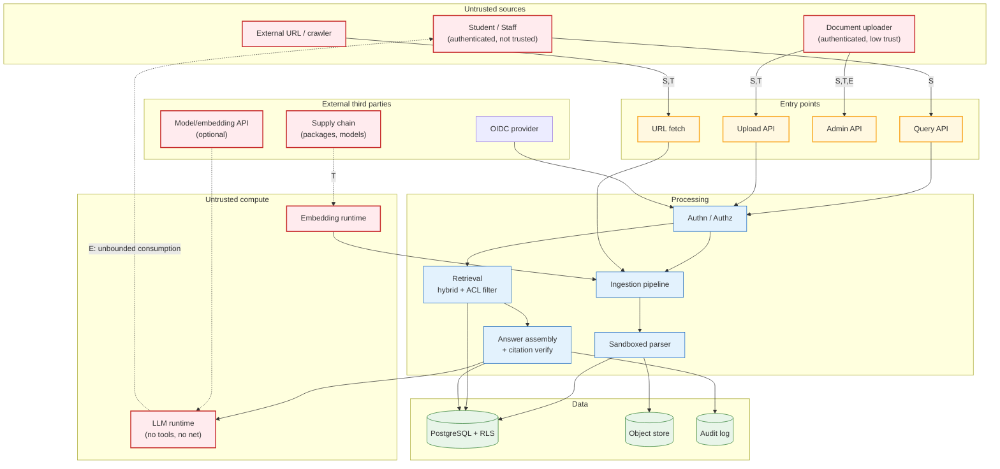

# §13 Security Threat Model

**Method.** STRIDE per component and data flow, extended with the OWASP Top 10 for LLM Applications
(2025) and the OWASP Top 10 (2021) for classical application security. Reference: NIST AI RMF 1.0
(GOVERN/MAP/MEASURE/MANAGE) for risk framing, and NIST SP 800-53 / CIS controls where a control maps to
a recognised safeguard.

**Risk rating.** Likelihood (L) × Impact (I), each 1–5: Low ≤ 4, Medium 5–9, High 10–15, Critical ≥ 16.
**Residual risk** is after the stated mitigations are implemented and verified.

**The organising insight:** most RAG security failures come from treating *content* as trusted when it
is actually attacker-controlled, or from treating *the model* as a security control when it is a
statistical component. The threat model below is built around those two mistakes.

---

## 13.1 Threat model diagram (STRIDE + trust boundaries)

**Note on X2 and X3.** The optional hosted model API and the model supply chain are drawn *outside* the
trust boundary on purpose. A model file is executable code pulled from the internet; treating a
`trust_remote_code: True` model as trusted code is one of the most common and most severe AI supply-chain
failures. `jina-embeddings-v3`-class models are declined for exactly this reason
([§10.8](09-technology-evaluation.md)).

---

## 13.2 Threat register

### Information disclosure

| ID | Threat | Attack surface | I | L | Risk | Mitigation | Residual | Test |
|---|---|---|:-:|:-:|---|---|---|---|
| **THR-001** | **Cross-tenant data leakage** — a query in tenant A returns tenant B's documents | Query API → retrieval → Postgres | 5 | 3 | **High** | Tenant scope injected by the data-access layer, never caller-supplied (R2); Postgres RLS as an independent second control; `tenant_id` leading column in every partition; cross-tenant test suite over 100 % of endpoints; cache key includes `acl_set_hash` | Low | Automated cross-tenant suite; RLS-bypass integration test proving the app layer alone is insufficient |
| **THR-002** | **Document-level authorisation bypass** — a user retrieves a chunk from a document they cannot read | Retrieval filter | 5 | 3 | **High** | `acl_principals` denormalised onto every chunk and evaluated **inside** the index scan; authorised candidate set verified inside the query layer, not asserted by the caller ([ADR-007](../../docs/04-adrs/ADR-007-authorisation-enforced-at-the-retrieval-layer.md)); negative tests per role × doc-type | Low | Matrix test: 12 roles × 8 doc types × 20 fixtures; asserts empty candidate set |
| **THR-003** | **Post-hoc filtering of citations** — unauthorised content reaches the model before being filtered | Answer service | 5 | 3 | **High** | Structurally impossible: filtering happens pre-generation. Documented as a prohibited pattern; architecture test asserts no code path can call the LLM with an unfiltered candidate set | Very low | Architecture test; code review rule |
| **THR-004** | **Sensitive information in logs** — query text, document snippets or PII logged and shipped to a third-party log sink | Logging pipeline | 4 | 4 | **High** | Structured schema with an explicit allow-list (NFR-010); PII-shaped values injected in a test and asserted absent; log sink is self-hosted; retention 14–30 days | Low | Automated redaction test on every log path |
| **THR-005** | **Third-party prompt logging** — hosted model API receives institutional document text | Optional model API | 4 | 3 | **High** | Hosted provider **disabled by default**; explicit per-tenant opt-in; data-classification check refuses to send P0/P1 content; local-first is the default architecture ([§10.9](09-technology-evaluation.md)) | Low | Test: P0/P1 content cannot reach an external endpoint; opt-in requires explicit config |
| **THR-006** | **System prompt leakage** — user extracts the system prompt to learn the guardrails | Query API | 2 | 4 | Medium | Prompt is not a security boundary (documented); all controls are architectural (no tools, ACL filter, output contract); leakage is therefore low-impact by design | Low | S11 slice includes prompt-extraction attempts |
| **THR-007** | **Data exfiltration via the model** — retrieved content from an authorised document is echoed into an answer the reader should not see | Answer service | 4 | 3 | **High** | Retrieval is already principal-scoped, so the model cannot see what the principal cannot; output contract; citations verified against chunks the principal was already entitled to | Low | Test: cross-document exfiltration attempt in S11 |

### Tampering

| ID | Threat | Attack surface | I | L | Risk | Mitigation | Residual | Test |
|---|---|---|:-:|:-:|---|---|---|---|
| **THR-008** | **Index/document tampering** — unauthorised modification of a published document or chunk | Admin API, DB | 5 | 2 | **High** | RBAC+ABAC on every lifecycle command; immutable versions (no in-place update); append-only audit log; DB role has no UPDATE grant on published version rows; publish requires re-auth + reason | Low | Attempt to modify a published version → denied; audit record exists |
| **THR-009** | **Version/supersession tampering** — an admin sets an effective window that hides an in-force rule | Admin API | 5 | 2 | **High** | Validation: supersession requires an explicit close date on the old version; no open-ended superseded versions; overlapping windows alert rather than auto-resolve; admin actions audited | Medium (insider) | Test: reject open-ended supersession; alert on overlap |
| **THR-010** | **Poisoned document** — a legitimate-permission uploader plants content that skews retrieval for everyone in the tenant | Upload → indexing | 4 | 3 | **High** | DRAFT→publish review gate; injection/malware heuristics quarantine; publishing restricted to P3+; per-source trust weighting; adversarial slices in the benchmark; duplicate/near-duplicate detection | **Medium — accepted** | S11 slice; quarantine test |
| **THR-011** | **Malicious metadata** — `title`/`author`/`section_path` carry injection payloads that reach a prompt position | Metadata extraction | 4 | 4 | **High** | Strict field whitelist; untrusted metadata may filter/boost/display but **must never enter an instruction position** ([BND-3](05-system-boundaries.md)); metadata values escaped and length-capped; prompt assembly is unit-tested with hostile metadata | Low | Unit test: hostile `title` in the corpus; assert it appears only in display/filter positions |
| **THR-012** | **ACL metadata tampering** — a document's `acl_principals` are set incorrectly | ACL service, DB | 5 | 3 | **High** | ACLs are computed by the authorisation layer from `document_acl` rows and refreshed on change; never accepted from an upload request; a reconciliation job asserts chunk ACLs match the authoritative ACL source | Low | Reconciliation test; direct-write test must fail |

### Repudiation / denial of service

| ID | Threat | Attack surface | I | L | Risk | Mitigation | Residual | Test |
|---|---|---|:-:|:-:|---|---|---|---|
| **THR-013** | **Repudiation of an answer** — a user claims they were told something else | Answer records | 3 | 4 | **High** | Immutable answer record: query, filters, candidate IDs + scores, prompt, model IDs, tokens, latency, timestamp, principal; append-only; retained ≥ 90 days | Low | Audit export test (FR-049) |
| **THR-014** | **Unbounded consumption (LLM)** — expensive queries exhaust capacity | Query API, model runtime | 4 | 4 | **High** | Per-principal and per-tenant quotas on queries/hour and tokens/day (`SEC-011`); context token cap; output token cap; circuit breakers; rate limiting at edge and app; 429 with `Retry-After` | Low | Quota exhaustion test; sustained load test |
| **THR-015** | **Resource exhaustion via oversized documents** — a 2 GB PDF or a zip bomb | Upload, parser | 4 | 4 | **High** | Size caps pre-parse; **content sniffing** not MIME trust; page/section caps; sandbox with CPU/memory/wall-clock/recursion limits; per-document time budget; non-retryable classification | Low | Zip bomb, 2 GB upload, PDF with 100k pages |
| **THR-016** | **Slowloris / connection exhaustion** | Edge, API | 3 | 4 | **High** | Edge timeouts and connection caps; per-IP and per-principal rate limits; bounded connection pools; `statement_timeout` on every DB call | Low | Load test at 3× |
| **THR-017** | **Index poisoning via embedding manipulation** — an adversary crafts text whose embedding attracts unrelated queries | Corpus → index | 3 | 3 | **Medium** | Deduplication and structural rerank reduce the surface; tenant isolation limits blast radius; the effect is *ranking noise*, not unauthorised access; monitored via per-source citation-share metrics that flag anomalies | Medium — accepted | Per-source citation-share anomaly alert |
| **THR-018** | **DDL / destructive action by a compromised admin account** | Admin API | 5 | 2 | **High** | Least-privilege DB roles; the application role cannot `DROP`/`TRUNCATE`; lifecycle actions are soft-delete; purge is a separate, audited, rate-limited job | Low | Privilege test |

### Information disclosure — technical (continued) and third-party risks

| ID | Threat | Attack surface | I | L | Risk | Mitigation | Residual | Test |
|---|---|---|:-:|:-:|---|---|---|---|
| **THR-019** | **SSRF via URL ingestion** — fetching an internal or cloud-metadata URL | URL fetch | 5 | 4 | **High** (if enabled) | **Deferred to Phase 4** (`OQ-007`). When enabled: allowlist of hosts, resolve-then-validate every hop, re-validate after redirects, block private/link-local/metadata ranges, egress proxy, no redirect following by default, scheme allowlist | Low once implemented | Tests: private IP literal, DNS rebinding, redirect-to-metadata, non-standard port, IPv6 forms — all fail closed |
| **THR-020** | **Path traversal in file handling** | Upload, object keys | 4 | 3 | **High** | Object keys are server-generated (`tenant/doc/version/uuid`), never derived from filenames; filenames stored as metadata only; parser runs in a temp mount with no host filesystem access | Low | Traversal filenames in the upload suite |
| **THR-021** | **Insecure deserialisation / parser RCE** | Sandbox parser | 5 | 3 | **High** | Sandboxed subprocess with no network, no credentials, minimal filesystem, resource limits; parsers kept patched; pinned versions + `pip-audit`; deserialisation avoided where possible | Medium (upstream CVEs) | Sandbox escape regression test; dependency scan gate |
| **THR-022** | **Model supply-chain compromise** — a model file executes code or is backdoored | Model download | 5 | 3 | **High** | **No `trust_remote_code`.** Pinned model revisions with checksums; conversion to ONNX/GGUF performed in a sandbox; provenance recorded per index version; models pulled only from a pinned allowlist | Low | CI check: no `trust_remote_code` anywhere; checksum verification test |
| **THR-023** | **Vulnerable dependency** | Build/deploy | 4 | 4 | **High** | Lockfile; `pip-audit`/Dependabot; SBOM per release; critical CVE blocks merge; dependency review on PRs; minimal dependency count is a design goal | Low | CI gate |
| **THR-024** | **Secret leakage in repo, image or logs** | Everywhere | 5 | 3 | **High** | Secrets only from env/secret store; never in code or images; `.env` ignored; gitleaks in CI; a deliberate canary secret test; secrets never passed to parsers or the model runtime | Low | Canary-secret test; image scan |

---

## 13.3 OWASP LLM Top 10 coverage

| OWASP LLM risk | Our control | Threats |
|---|---|---|
| **LLM01 Prompt Injection** | Structural separation of instructions and untrusted data; no tools/agency; typed output contract; detection is defence-in-depth only | THR-006, THR-007, THR-010, THR-011 |
| **LLM02 Sensitive Information Disclosure** | ACL pushdown at retrieval; PII never logged; no data egress by default; answer records access-controlled | THR-001…005 |
| **LLM03 Supply Chain** | No `trust_remote_code`; pinned revisions + checksums; SBOM; minimal dependencies | THR-022, THR-023 |
| **LLM04 Data and Model Poisoning** | DRAFT→publish gate; quarantine heuristics; deduplication; per-source citation-share anomaly monitoring | THR-010, THR-017 |
| **LLM05 Improper Output Handling** | All model output rendered as text; typed output contract validated before use; CSP; no HTML execution | THR-007 |
| **LLM06 Excessive Agency** | **No tools, no function calling, no write actions, no network.** This is an architectural property, not a policy | THR-007 |
| **LLM07 System Prompt Leakage** | Prompt is not a security boundary; all controls are architectural | THR-006 |
| **LLM08 Vector and Embedding Weaknesses** | Tenant-scoped indexes; ACL pushdown; embedding-model provenance per chunk; no cross-model vector comparison; index rebuild is deterministic | THR-002, THR-017 |
| **LLM09 Misinformation** | Grounding gate; abstention; deterministic citation verification; temporal/supersession correctness; conflict surfacing | Journey C, Journey G |
| **LLM10 Unbounded Consumption** | Per-tenant and per-principal quotas; token caps; rate limits; circuit breakers | THR-014, THR-015 |

**The strongest mitigation in this table is LLM06.** By having no agency, most of LLM01 and LLM02 become
non-exploitable rather than merely monitored. This is a design decision made in Phase 0 so that it is
not accidentally undone later.

---

## 13.4 Abuse cases

| Abuse | Vector | Control |
|---|---|---|
| Exfiltrate a colleague's restricted document by crafting a query | Query API | ACL pushdown; the chunk never enters the candidate set; no citation to filter |
| Poison the index for everyone by uploading a crafted circular | Upload | DRAFT→publish; heuristics; P3+ only; anomaly metrics |
| Drain the budget with a few thousand long queries | Query API | Per-principal quotas; context caps; rate limit; breaker |
| Bypass limits with account farms | Auth | IdP rate limits; per-tenant seat/principal quotas; anomaly detection on registration |
| Use a document as a covert channel to other users | Corpus | Per-document provenance + citation anomalies; restricted content never indexed |
| Probe the system for internal data via the admin API | Admin API | RBAC+ABAC; separate admin scope; admin actions audited |
| Force the LLM to emit executable content | Corpus | Text-only rendering; CSP; no HTML sink |

---

## 13.5 Accepted residual risks

Three risks are **accepted, not mitigated**, and each has a named trigger to revisit:

| Risk | Why accepted | Trigger to revisit |
|---|---|---|
| **THR-010 / THR-017 — poisoned content degrades ranking quality** | Preventing it entirely is impossible while allowing authorised users to publish text. Content that is *readable* by a permitted user cannot be prevented from being retrievable. The containment is that impact is **ranking noise, not data exposure**, and publishing is gated | Evidence of a real-world exploit; a tenant with untrusted uploaders (e.g. student-submitted content) |
| **THR-021 — upstream parser CVEs** | The parsers we need are third-party C libraries with a real CVE history. Mitigation is containment (sandbox), not prevention | A parser CVE with an exploitable impact that escapes the sandbox |
| **LLM01 residual — injection via non-English or novel phrasing evading heuristics** | Heuristic detection is fundamentally incomplete | Never, as long as layers 1–5 remain structural. If the project ever adds tools or agency, this changes entirely |

---

## 13.6 Security test strategy

| Suite | Runs | Scope | Gate |
|---|---|---|---|
| Tenant isolation | Every PR | Cross-tenant access on every endpoint | **Blocking** |
| ACL matrix | Every PR | 12 roles × 8 doc types × 20 fixtures | **Blocking** |
| Injection corpus | Every PR + nightly | S11 (40 items) incl. non-English | **Blocking** — requires 1.00 |
| Upload hardening | Every PR | Zip bomb, ELF-as-PDF, traversal names, oversized, MIME mismatch | **Blocking** |
| SSRF (once enabled) | Every PR | Private IP, DNS rebinding, redirect-to-metadata, IPv6 oddities | **Blocking** |
| Citation verification | Every PR | Fabricated spans must be stripped | **Blocking** |
| Privilege & secrets | Every PR | Least-privilege assertions; canary secret absent from image/logs | **Blocking** |
| Sandbox escape regression | Every PR | Parser cannot touch network/credentials/host FS | **Blocking** |
| Dependency & SAST | Every PR | `pip-audit`, Bandit, Semgrep | **Blocking on critical** |
| Threat-model review | Quarterly + on design change | Re-walk STRIDE per data-flow change | Manual |

**The ACL and tenant-isolation suites are written by someone who did not write the feature.** For
security-critical tests, self-authored tests systematically test what the author believed, which is
precisely what is wrong. If that is not possible solo, the mitigation is to make the suites
**data-driven from the policy table** so a missing case is a data problem rather than an oversight.