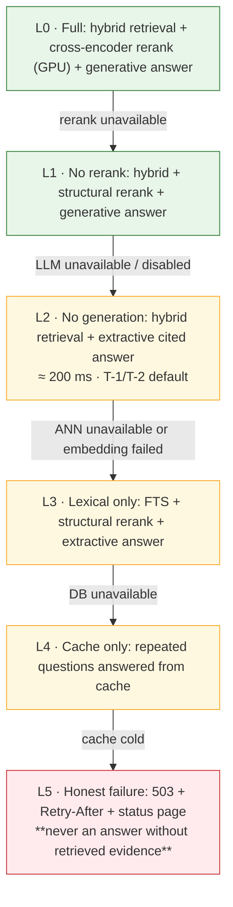

# §14 Reliability Model

**Principle.** An SLO is a promise about user experience, not about uptime of a machine. Every target
below is justified against a user-visible harm, and every SLO has an error budget with a defined
action when it is spent.

---

## 14.1 What "reliable" means for this system

The availability of a *search* feature and the availability of a *grounded answer* feature are
different products with different dependencies. Conflating them produces SLOs that are either
unachievable or meaningless.

| Capability | Depends on | Degraded without |
|---|---|---|
| **Search / passage retrieval** | Postgres + pgvector | Nothing — this is the floor |
| **Extractive answer** | Search + citation verification | Nothing |
| **Generative answer** | Search + LLM runtime | Falls back to extractive |
| **Ingestion** | Worker + parser + embedding | Nothing — existing corpus unaffected |
| **Administration** | Admin service + DB | Read-only operation |

The system is designed so that the **bottom two rows of that table never depend on anything above them**.

---

## 14.2 SLIs

An SLI is a measured ratio; an SLO is a target on that ratio.

| ID | SLI | Definition | Why this SLI |
|---|---|---|---|
| **SLI-01** | Availability | 1 − (5xx responses ÷ total responses), per endpoint class | The primary user-facing promise |
| **SLI-02** | Answer latency | Time to complete answer, p50/p95/p99, **by path** (extractive / generative) | Users feel latency more than uptime |
| **SLI-03** | Search latency | Time to return passages | The fast path's promise |
| **SLI-04** | Freshness | upload → searchable, and publish → retrievable | Admin trust depends on this |
| **SLI-05** | Answer correctness (proxy) | Citation correctness + abstention correctness on a synthetic sample | A "successful" wrong answer is an outage with a 200 status |
| **SLI-06** | Ingestion success | published ÷ accepted (excluding quarantined) | Detect a pipeline silently rejecting everything |
| **SLI-07** | Queue health | Depth + age of the oldest unclaimed job | Backpressure early-warning |
| **SLI-08** | Degradation rate | Fraction of responses served in a degraded mode | Detects a slow-burn dependency failure |
| **SLI-09** | Tenancy isolation** | Cross-tenant policy violations (**target: exactly 0**) | Not an SLO — a **release blocker** |
| **SLI-10** | Injection resistance** | Behaviour changes caused by adversarial documents (**target: exactly 0**) | Not an SLO — a **release blocker** |

**SLI-05 is unusual and deliberate.** In a knowledge system, an answer that is confidently wrong and
returns HTTP 200 is *worse* for the user than an error, because the user acts on it. Tracking only
availability would report 99.9 % "success" while the system is systematically misleading people.
This is the reliability expression of the §1.5 thesis.

**SLI-09 and SLI-10 are binary gates, not ratios.** Their failure is an incident regardless of
percentage.

---

## 14.3 SLOs

### T-3 (production-scale architecture)

| SLI | SLO | Justification |
|---|---|---|
| SLI-01 Availability, query API | **99.9 % monthly** | The modelled workload (133 QPS sustained) is small enough that 99.9 % is achievable with replicas and is the industry-standard bar for a user-facing service. Going to 99.95 %/99.99 % buys very little for a knowledge assistant and costs meaningfully |
| SLI-01 Availability, admin API | **99.5 %** | Admin work is occasional and retryable; a lower target is the right trade |
| SLI-03 Search p95 | **< 250 ms** | Feels instant; budget [§4.6](03-scale-model.md#46-latency-budget-t-2-gpu-backed-tier) allows 195 ms |
| SLI-02 Extractive answer p95 | **< 400 ms** | Still sub-second |
| SLI-02 Generative answer p95 | **< 8 s**; TTFT **< 1.2 s** | Budget totals ~5.7 s; 8 s leaves headroom for p99. TTFT matters more for perceived latency |
| SLI-04 Freshness (upload ≤ 5 MB → searchable) p95 | **< 60 s** | Admin wants confirmation; 60 s is fast enough to feel immediate and achievable with batched embedding |
| SLI-04 Freshness (publish → retrievable) p95 | **< 5 s** | A pointer flip; 5 s is generous for correctness headroom |
| SLI-06 Ingestion success | **≥ 99 %** of accepted documents | Quarantined documents are counted separately — a high quarantine rate is a *content* problem, not a reliability one |
| SLI-08 Degradation rate | **< 1 %** | A steady trickle of degraded responses means a dependency is unhealthy |
| SLI-07 Queue age | **< 5 min** | Beyond this, freshness degrades; alert at 2 min, page at 10 min |

### T-2 (free cloud VM) — deliberately lower

| SLI | SLO | Reality |
|---|---|---|
| SLI-01 Availability | **~99 %** | Free tiers sleep, reboot, and have no SLA. **This is stated, not hidden.** An architecture that promises 99.9 % on a free sleeping VM would be lying |
| SLI-03 Search p95 | < 500 ms | Single instance, no replicas |
| SLI-02 Extractive answer p95 | < 900 ms | |
| SLI-02 Generative answer | **Not an SLO on T-2.** Measured ~60 s with a local LLM ([§4.7](03-scale-model.md#47-generation-feasibility-on-the-free-tier)); labelled "slow mode" | |
| SLI-04 Freshness | < 5 min | Embedding at ~1.3–4.5 chunks/s on CPU ([§4.3](03-scale-model.md#43-embedding-throughput--the-real-constraint)) |

### T-1 (laptop)

| SLI | SLO |
|---|---|
| SLI-01 | 100 % (localhost) |
| SLI-03 / SLI-02 extractive | < 300 ms |
| SLI-02 generative | < 12 s |

**The three-tier presentation is the honest engineering answer to "free-first".** A single SLO applied
to all tiers would be either unachievable (free) or needlessly loose (production).

---

## 14.4 Error budgets and the policy attached to them

| Tier / SLO | Monthly error budget (30.44 days = 43,626 min) | Consumption policy |
|---|---:|---|
| T-3 99.9 % availability | **43.6 min/month** | At 50 % consumption (21.8 min): freeze non-essential changes, prioritise stability work |
| T-3 99.5 % admin | **218 min/month** | No change freeze; review monthly |
| T-3 generative p95 < 8 s | Not a time budget — use a request budget: **< 0.5 % of requests may exceed 2× the SLO** | Same freeze rule at 50 % |
| T-3 freshness p95 < 60 s | **< 1 % may exceed 180 s** | Same |
| T-2 99 % | **437 min/month** | Documented; a breach is expected and is not treated as a team failure |

**Policy details that make error budgets real rather than decorative:**

1. A burn-rate alert fires at **14.4× consumption over 1 h** (fast) and **6× over 6 h** (slow), the
   standard multi-window approach.
2. Spending 100 % of the budget **freezes feature work** for the remainder of the period. This is the
   only rule that makes error budgets consequential.
3. Reliability work and feature work share the same budget; there is no separate "error budget for
   reliability".
4. A **frozen** budget is not rolled over. Carryover invites gradual erosion.
5. T-2 has a documented, expected error budget; breaching it triggers a **capacity/plan change** (move
   to a paid VM or reduce scope), not an engineering heroics cycle.

---

## 14.5 Failure domains

```mermaid
graph TB
    subgraph F1["F1 · Process crash"]
        direction LR
        A1["api dies"] --> R1["LB replaces it<br/>NFR-005: no local state →<br/>zero data loss"]
        A2["worker dies"] --> R2["Job visibility timeout<br/>reclaimed by another worker<br/>content hash → no-op retry"]
    end
    subgraph F2["F2 · Model runtime failure"]
        direction LR
        B1["LLM down"] --> RB1["Breaker opens → extractive path<br/>NO user-visible outage"]
        B2["Embedding down (query)"] --> RB2["Lexical-only retrieval<br/>degraded flag"]
        B3["Embedding down (bulk)"] --> RB3["Ingestion pauses;<br/>queries unaffected"]
    end
    subgraph F3["F3 · Data plane failure"]
        direction LR
        C1["Postgres unavailable"] --> RC1["**Total outage** —<br/>no honest fallback exists"]
        C2["ANN index corrupt/unavailable"] --> RC2["Lexical leg only;<br/>shadow rebuild + atomic swap"]
        C3["Disk full"] --> RC3["Reject writes with a clear error;<br/>alert; ingestion pauses first"]
    end
    subgraph F4["F4 · External dependency"]
        direction LR
        D1["OIDC unavailable"] --> RD1["Fail **closed** on new logins.<br/>Existing sessions continue<br/>via token lifetime"]
        D2["Optional hosted model"] --> RD2["Circuit open → extractive"]
    end
    subgraph F5["F5 · Bad data"]
        direction LR
        E1["Parser produces garbage"] --> RE1["Yield/quality check →<br/>quarantine"]
        E2["Wrong metadata extraction"] --> RE2["Admin review before publish"]
        E3["Model returns malformed output"] --> RE3["Contract validation →<br/>fallback to extractive"]
    end
```

### The irreducible dependency

**PostgreSQL is a single point of failure.** Every capability needs it: the corpus, the ACLs, the
queue, the answer records. This is a deliberate consequence of the one-engine decision
([ADR-002](../../docs/04-adrs/ADR-002-postgresql-pgvector-as-the-single-data-store.md)) — the same
choice that buys ACID-across-publication and removes a whole class of inconsistency also creates one
hard dependency.

**Mitigations, in order of value:**

| Mitigation | Cost | Effectiveness |
|---|---|---|
| Managed Postgres with automated failover (T-3) | Paid | High — removes the domain, not the dependency |
| Streaming replica + documented manual promotion (T-2/T-3 self-hosted) | Low | Medium — reduces RTO, does not remove downtime |
| Point-in-time recovery + tested restores | Low | Recovery, not availability |
| **Explicit statement to users that search is unavailable** | Free | Prevents the worst outcome: a system that answers without retrieval |

There is deliberately **no "degraded read-only mode" built from a cache**. Serving stale cached answers
to a policy system, with no way to indicate staleness, is the same class of failure as answering with a
superseded rule. If the database is down, the product says so. This is a case where **less capability is
more correct**.

---

## 14.6 RTO and RPO

| Scenario | T-1 | T-2 | T-3 | Notes |
|---|---|---|---|---|
| **Instance crash** | RTO 1 min | RTO 10 min | RTO 1 min | Restart; no local state |
| **Disk/database corruption** | RTO 1 h | RTO 4 h | RTO 1 h | Restore from backup |
| **Region loss** | n/a | n/a | RTO 4 h | Cross-region standby |
| **RPO — documents** | 0 (local file) | 24 h | 15 min | Nightly backup (T-2) / PITR (T-3) |
| **RPO — answers/audit** | 0 | 24 h | 15 min | Audit loss is a compliance event; T-2's 24 h is a documented, accepted gap |
| **RPO — in-flight ingestion jobs** | 0 | ≤ 1 job | ≤ 1 job | At-least-once + idempotency; a lost job is redone, not lost |

**Why T-2's RPO is 24 hours and not "zero".** Free-tier volumes are typically ephemeral in some
providers and lack PITR in others. Claiming a 15-minute RPO without a paid backup product would be a
false commitment. The honest position is: **the free tier can lose up to 24 h of uploaded content and
audit records**, mitigated by object-storage versioning and a nightly dump, with the limitation stated
to the operator at deploy time rather than discovered during an incident.

**Backup and restore are tested, not assumed** (OPS-012). A restore drill is part of Phase 11 exit
criteria: restore to a clean environment and verify document count, vector integrity, ACL integrity and
answer-record continuity.

---

## 14.7 Degradation ladder

Read top to bottom. The system steps **down** to the first level that is fully functional, and each
level is a **complete, honest product** rather than a broken version of the previous one.

### Rules for every level

| Rule | Reason |
|---|---|
| The response **declares its level** (`degraded: lexical_only`) | Users and support must know which mode answered |
| No level ever produces an answer **without** retrieved, authorised, temporally-valid evidence | The one invariant that never breaks |
| No level ever serves an answer whose citation cannot be resolved | Broken citations are worse than none |
| Degradation is **per-tenant and per-feature**, not global | One tenant's disabled generation must not affect another |
| Breaker state is **observable**, and a long stay at L2/L3 raises an alert | Chronic degradation is an incident even when the service "works" |
| Re-enablement is **gradual and probed** | Prevent flapping and retry storms |

**Measured quality at each level is a project deliverable**, not an assumption. "How much worse is
lexical-only retrieval?" is a benchmark number from Phase 7. If lexical-only Recall@20 collapses from
0.95 to 0.55, then L3 is nearly useless and the product should say *"search is temporarily
degraded"* rather than presenting weak results as normal. **We do not know this number yet, and
pretending otherwise would be the most dishonest thing in this document.** It is scheduled as a
Phase 7 deliverable and recorded as [OQ-015](21-open-questions.md).

---

## 14.8 Dependency failure policy

| Dependency | Failure mode | Policy | User impact |
|---|---|---|---|
| **Postgres** | Unavailable | Fail loudly; no cache-only answering of novel queries | Search and answers unavailable |
| **Postgres** | Slow | `statement_timeout` per stage; breaker on the query path | Timeout → 503 with `Retry-After` |
| **Postgres** | Read replica lag | Reads of answers may lag; **document reads must not** | Slight staleness on analytics only |
| **LLM runtime** | Down / OOM / timeout | Breaker → L2 extractive | Slower, less fluent, still correct |
| **LLM runtime** | Slow generation | Per-request timeout at the stage budget | Falls back mid-request |
| **Embedding runtime** | Down (query) | Lexical leg only | Reduced recall; flagged |
| **Embedding runtime** | Down (bulk) | Ingestion pauses, queue grows; backlog alerted | New documents delayed; existing search fine |
| **Object store** | Unavailable | Ingestion blocks; queries unaffected (chunks are in Postgres) | New uploads delayed |
| **OIDC provider** | Unavailable | Fail closed for new logins; existing tokens valid until expiry | New users cannot log in for the token lifetime |
| **Optional hosted model** | Unavailable/rate-limited | Breaker → local or extractive | Falls back |
| **Frontend CDN** | Unavailable | Served from origin | Slower first load |

**The pattern:** read paths degrade; write paths pause; identity fails closed. Never the reverse.

---

## 14.9 Load-shedding and backpressure

| Overload source | Response | Rationale |
|---|---|---|
| Query surge | Rate limit per principal, then per tenant | Protects fairness between tenants |
| Tenant floods ingestion | Ingestion concurrency limit per tenant; queue depth cap | Query latency must not be affected by one tenant's bulk import (**noisy neighbour**) |
| Global overload | Shed generation first (L2), then lexical (L3), then 429 | Shed the **most expensive** capability first |
| Queue full | `503` + `Retry-After`; new ingestion jobs rejected | Backpressure rather than unbounded growth (NFR-007) |
| Model OOM under load | Batch size reduction, then breaker, then extractive | Degrade rather than crash |

**Autoscaling is deliberately excluded for T-1/T-2.** At 133 QPS sustained and ~10 jobs/s ingestion,
a fixed worker count with a bounded queue is sufficient and free. Autoscaling is introduced at a §7.7
trigger. This is an example of complexity deliberately not added.

---

## 14.10 Incident response

| Element | Definition |
|---|---|
| Severity 1 | Cross-tenant leakage, system-wide outage, or **systematically wrong answers** (e.g. supersession broken) |
| Severity 2 | Degradation sustained > 15 min; ingestions failing > 10 %; p95 latency 2× over SLO for 30 min |
| Severity 3 | Isolated failure with a workaround; error rate < 5 % |
| Severity 4 | Cosmetic, no user impact |

| Requirement | Detail |
|---|---|
| Detection | Alert fires with a link to a runbook (`OPS-010`); every paging alert has a **verification step** |
| Triage | Check the service dashboard: SLO burn, degradation level, queue age, per-tenant view |
| Mitigation first | Roll back the last deploy, disable a feature flag, shed generation — before root-causing |
| Communication | State the degradation level in user-visible terms ("showing excerpts; narrative answers unavailable") |
| Learning | Postmortem within 5 working days ([OPS-013](02-requirements.md#34-operational-requirements-ops)) |
| Postmortem content | Timeline, impact in user terms, contributing factors (plural), what went well, action items with owners and dates. **Blameless.** Repeat incidents require an escalation to a design change |

**Runbooks required at Phase 11 exit** (each with a verification step and an escalation path):
`RB-INGEST-01` pipeline stalled · `RB-RETRIEVAL-02` ANN index unavailable · `RB-LLM-01` generation down ·
`RB-DB-01` database unresponsive · `RB-FRESHNESS-03` queue backlog · `RB-SEC-01` suspected cross-tenant
access · `RB-INC-00` generic triage entry point.

---

## 14.11 SLO review trigger

The SLOs are **proposals with a review date**, not permanent truths. Revisit after the first 30 days of
real traffic, when actual usage (DAU, concurrency ratio, question mix, abstention rate, degradation
frequency) replaces ASM-003, ASM-004, ASM-005 and ASM-006 with measurements. **Any SLO not revisited
within two quarters is treated as unowned and re-examined.**