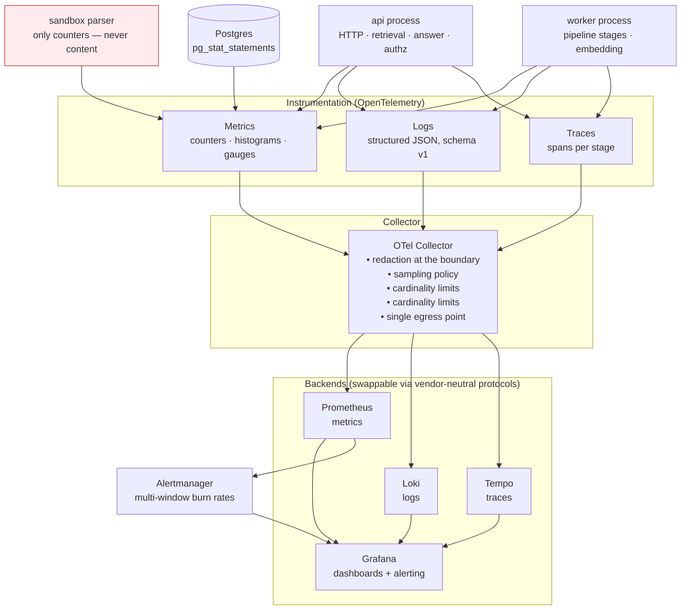

# §15 Observability Model

**Principle.** "Every important operation should be observable" is only meaningful if each signal is
tied to an **SLO**, a **user-visible symptom**, and a **human action**. A metric nobody alerts on and
nobody queries is a cost with no benefit. The signal catalogue below therefore carries all three columns.

**Non-negotiable constraint** ([NFR-010](02-requirements.md#32-non-functional-requirements-nfr),
[BND-4](05-system-boundaries.md)): **telemetry never contains document content or raw query text.**
Identifiers, scores, counts and timings only. Query text lives in the access-controlled answer record,
not in logs — which prevents both PII leakage and log injection.

---

## 15.1 Observability architecture

**Why OpenTelemetry everywhere.** It is the only observability choice in this project where leaving is
a configuration change rather than a rewrite. That portability is worth more than any single backend's
features. The Collector is also the **single redaction and cardinality-control point**, which is the
only place that reliably enforces the "no content in telemetry" rule.

**Cardinality discipline.** Metric labels must never include user IDs, document IDs, query text or
request IDs. High-cardinality dimensions go to **traces and logs**, not metrics, or Prometheus is
destroyed. This is stated because it is the most common self-inflicted observability outage.

---

## 15.2 Metrics

### Serving metrics

| Metric | Type | Labels | Maps to | Alert |
|---|---|---|---|---|
| `http_requests_total` | counter | route, method, status_class | SLI-01 | 5xx rate |
| `http_request_duration_seconds` | histogram | route, mode (extractive/generative) | SLI-02, SLI-03 | p95/p99 burn |
| `answers_total` | counter | mode, outcome (answered/abstained/degraded) | SLI-05 | abstention-rate shift |
| `answers_abstained_total` | counter | reason (below_threshold/no_verifiable_citations) | SLI-05 | rate shift |
| `search_latency_seconds` | histogram | leg (fts/ann), tier | SLI-03 | leg imbalance |
| `retrieval_stage_duration_seconds` | histogram | stage (embed/fuse/filter/rerank/dedupe/assemble) | PERF-010 | stage regression |
| `retrieval_candidates_total` | histogram | source (fts/ann), post-filter | Quality | post-filter collapse |
| `degraded_responses_total` | counter | reason (lexical_only/no_rerank/no_generation) | SLI-08 | > 1 % |
| `cache_hits_total` / `cache_requests_total` | counter | namespace_type | PERF cost | hit rate < 30 % |
| `citations_verified_total` | counter | result (verified/stripped) | SLI-05 | strip rate > 3 % |
| `generation_circuit_state` | gauge | — | Degradation | open > 5 min |
| `llm_tokens_total` | counter | tenant_hash, direction | Cost | — |
| `llm_request_duration_seconds` | histogram | model, outcome | SLI-02 | — |

### Ingestion metrics

| Metric | Type | Labels | Maps to | Alert |
|---|---|---|---|---|
| `ingestion_documents_total` | counter | stage, outcome | SLI-06 | failure-rate shift |
| `ingestion_stage_duration_seconds` | histogram | stage | PERF-005 | stage regression |
| `ingestion_freshness_seconds` | histogram | doc_size_bucket | SLI-04 | p95 > SLO |
| `chunks_embedded_total` | counter | model | Cost | — |
| `embedding_throughput_chunks_per_second` | gauge | worker | PERF-007 | < target |
| `job_queue_depth` | gauge | queue, state | SLI-07 | > 1,000 |
| `job_queue_oldest_age_seconds` | gauge | queue | SLI-07 | > 120 s warn / > 600 s page |
| `job_retries_total` | counter | job_type, reason | — | spike |
| `dead_letter_depth` | gauge | reason | — | **any growth pages** |
| `quarantined_documents_total` | counter | reason | Security | spike |
| `parser_timeouts_total` | counter | format | THR-015 | spike |
| `documents_published_total` | counter | doc_type | — | — |

### Security metrics

| Metric | Type | Labels | Alert |
|---|---|---|---|
| `authz_decisions_total` | counter | decision (allow/deny), resource_type | deny-rate anomaly |
| `authz_denied_total` | counter | reason | per-tenant spike |
| `cross_tenant_violations_total` | counter | — | **any non-zero pages immediately** |
| `upload_rejected_total` | counter | reason (type/size/heuristic/quota) | spike |
| `injection_signals_total` | counter | pattern, language | spike; per-tenant |
| `citation_source_share` | gauge | source_id | **anomaly in a source's citation share — poisoning detector** |
| `rate_limit_rejections_total` | counter | tier, subject_type | spike |
| `secret_scan_findings` | gauge | — | any critical |

**`cross_tenant_violations_total` alerting at non-zero with page severity** reflects that this metric
should be structurally impossible. If it fires, something has bypassed two independent controls, and
that is a Sev-1 by definition regardless of volume.

### Resource metrics

| Metric | Purpose |
|---|---|
| `process_resident_memory_bytes` | Bounded memory is what makes horizontal scaling safe (PERF-014) |
| `process_cpu_seconds_total` | Saturation |
| `db_connections_in_use` / `db_pool_wait_seconds` | Pool exhaustion precedes outage |
| `db_query_duration_seconds{statement_class}` | `pg_stat_statements`; slow queries are a leading indicator |
| `db_index_build_duration_seconds` | Reindex planning |
| `db_deadlock_total` | Concurrency health |
| `db_disk_used_ratio` | Disk exhaustion is a hard outage |
| `db_replica_lag_seconds` | Read staleness |
| `http_open_connections`, `queue_backlog` | Overload signals |

---

## 15.3 Logs

**Schema (v1), one JSON object per line:**

| Field | Type | Notes |
|---|---|---|
| `ts` | RFC3339 UTC | |
| `level` | enum | `debug`/`info`/`warn`/`error` |
| `msg` | string | Stable, greppable event name |
| `request_id` | string | Propagated from client or generated |
| `trace_id` / `span_id` | string | OTel linkage |
| `tenant_id` | uuid | Present on all tenant-scoped events |
| `principal_id` | hashed | **Hashed** — never the raw subject |
| `route`, `method`, `status` | | HTTP context |
| `duration_ms` | number | |
| `event` | enum | `query.completed`, `ingest.stage_failed`, `authz.denied`, … |
| `error.type`, `error.code` | enum | Taxonomy ([below](#154-error-taxonomy)) |
| `retrieval.mode`, `retrieval.degraded` | | |
| `model.llm_id`, `model.embedding_id`, `model.reranker_id` | | Provenance |
| `tokens.prompt`, `tokens.completion` | int | Cost tracking |

**Never present:** document text, chunk text, query text, filenames, PII, tokens, secrets.

### Log levels are a cost decision

| Level | Contents | Retention |
|---|---|---|
| `error` | Failures with taxonomy codes; always actionable or an alert | 30 days |
| `warn` | Degradation, retries, quarantine, breaker changes | 30 days |
| `info` | Request completions, job lifecycle transitions | 14 days |
| `debug` | Stage-level detail | Sampled 1 %; 3 days |

**Debug logging is sampled, never global.** An unsampled debug level on a high-QPS service is a disk
exhaustion outage — a failure mode this project explicitly guards against with a disk-usage alert.

### Redaction

Redaction happens **at the OTel Collector**, not in application code, because one forgotten call site in
application code is enough. The collector drops or hashes a defined key set. The application also
*avoids emitting* content, so the two controls are independent — the same defence-in-depth pattern used
for tenant isolation.

---

## 15.4 Error taxonomy

A closed set, so that alerts group correctly and clients can branch on `error.code` (FR-043).

| Code | Meaning | Retryable? | Default severity |
|---|---|---|---|
| `auth_failed` | Token invalid/expired | After refresh | 4 |
| `authz_denied` | Authenticated but not permitted | No | 4 |
| `tenant_mismatch` | Request tenant ≠ principal tenant | No | **1** |
| `rate_limited` | Quota or rate limit | Yes, with `Retry-After` | 4 |
| `validation_failed` | Request schema invalid | No | 4 |
| `quota_exceeded` | Storage/token/query quota | No | 3 |
| `document_quarantined` | Failed validation or heuristics | No | 3 |
| `parse_failed` | Parser error | Sometimes | 3 |
| `ingestion_backpressure` | Queue full | Yes | 3 |
| `retrieval_unavailable` | Both retrieval legs failed | Yes | 2 |
| `retrieval_degraded` | One leg unavailable | n/a (informational) | 4 |
| `llm_unavailable` | Generation unavailable | Yes (fallback active) | 2 |
| `llm_invalid_output` | Contract validation failed | Fallback | 2 |
| `model_timeout` | Stage budget exceeded | Yes | 2 |
| `db_unavailable` | Database error | Yes | **1** |
| `db_timeout` | `statement_timeout` | Yes | 2 |
| `conflict` | Optimistic-lock / concurrent publish | Yes, after refresh | 4 |
| `not_found` | Resource does not exist or is not visible | No | 4 |
| `internal_error` | Anything unclassified | Unknown | 2 |

**`internal_error` must be < 5 % of errors.** A high rate means the taxonomy is incomplete, which means
alerting is grouping wrongly. This is a measurable code-health signal and is reviewed monthly.

---

## 15.5 Traces

### Span design

One trace per **question** is the unit that matters — a question is the product. Its spans:

| Span | Attributes (no content) | Why |
|---|---|---|
| `http.request` | route, status, tenant | Entry |
| `authn.verify` | issuer, result | |
| `authz.decide` | decision, policy_name, acl_set_hash | **Security audit trail in the trace** |
| `cache.lookup` / `cache.store` | hit/miss, namespace | |
| `retrieval.query` | `mode`, `filters_applied`, `as_of` | Reproducibility |
| `retrieval.embed_query` | model, dim, duration | |
| `retrieval.lexical` | candidates_in/out | |
| `retrieval.ann` | candidates_in/out, `ef_search` | |
| `retrieval.fuse` | fusion, k, candidates_out | |
| `retrieval.filter` | filtered_out by reason (acl/temporal/superseded) | **The most valuable debug span in the system** |
| `retrieval.rerank` | ranker, candidates, skipped(reason) | |
| `retrieval.dedupe` | removed, tokens_before/after | |
| `answer.ground_gate` | top_score, threshold, decision | Abstention diagnosis |
| `answer.assemble` | context_tokens, budget, truncated | |
| `answer.generate` | model, tokens, finish_reason | |
| `answer.verify_citations` | checked, verified, stripped | |
| `answer.persist` | — | |

**`retrieval.filter` is the most important span.** When a user reports "it gave me the old regulation",
this span shows whether the old version was never retrieved (a filter bug), retrieved and dropped (a
ranker bug), or retrieved and answered (a generation bug). Those are three different incidents.

### Ingestion trace

Per document version: `ingest.job` → `validate` → `parse` (sandbox) → `structure` → `normalise` →
`chunk` → `embed` (batch spans) → `index_write` → `publish`, each with attempt count and stage outcome.
A failed job's trace is the primary debugging artefact for the DLQ.

### Sampling policy

| Span set | Sampling |
|---|---|
| Errors | 100 % |
| p99-latency outliers (slowest 1 %) | 100 % |
| Degraded responses | 100 % |
| Cross-tenant / authz denials | 100 % |
| Normal requests | 1 % head-based |
| Ingestion | 100 % (low volume, high diagnostic value) |

**Retain full fidelity for all P0-class events regardless of sampling**, because these are the traces
you need during an incident and they are rare enough that volume is not a concern.

---

## 15.6 Alerts

Every paging alert has: a **symptom a user would feel**, a **runbook link**, a **severity**, and a
**verification step**. Alerts on causes (high CPU) exist only where they are a genuine leading indicator
of a user-visible symptom — otherwise they are noise.

| Alert | Condition | Sev | Symptom | Runbook |
|---|---|:-:|---|---|
| Cross-tenant violation | `cross_tenant_violations_total > 0` | **1** | Data breach | `RB-SEC-01` |
| Availability burn (fast) | 14.4× budget burn, 1 h | **2** | Requests failing | `RB-INC-00` |
| Availability burn (slow) | 6× burn, 6 h | 2 | | `RB-INC-00` |
| Latency burn | p95 > 2× SLO, 15 min | 2 | Slow answers | `RB-LLM-01` |
| DLQ growth | `dead_letter_depth > 0` | 2 | Documents not published | `RB-FRESHNESS-03` |
| Queue age | oldest job > 600 s | 2 | Documents not searchable | `RB-FRESHNESS-03` |
| Freshness | p95 > 3× SLO, 30 min | 3 | Admin cannot confirm publication | `RB-INGEST-01` |
| Circuit open | generation breaker open > 5 min | 3 | Answers less fluent | `RB-LLM-01` |
| Degradation rate | > 1 % for 15 min | 3 | Answers less relevant | `RB-RETRIEVAL-02` |
| Injection signals | > 10 / tenant / 10 min | 2 | Possible poisoning campaign | `RB-SEC-02` |
| Citation strip rate | > 3 % for 30 min | 2 | **Answers may be ungrounded** | `RB-QUAL-01` |
| Disk > 85 % | | 2 | Ingestion will stop | `RB-DB-01` |
| Connection pool saturation | > 90 % for 5 min | 2 | Latency climbing | `RB-DB-01` |
| Backup not completed | No success in 26 h | 2 | RPO at risk | `RB-OPS-01` |
| Abstention-rate shift | > 3σ from 7-day baseline | 3 | Model or index drift | `RB-QUAL-01` |
| Embedding throughput | < target for 30 min | 3 | Freshness degrading | `RB-FRESHNESS-03` |

**Two alerts deserve emphasis:**

- **Citation strip rate** is the closest thing this system has to a "the answers are wrong" detector.
  A spike means the model is producing claims that do not survive verification — a quality incident with
  a real user impact, not a curiosity.
- **Abstention-rate shift** is the best cheap detector of silent retrieval degradation. If the model
  suddenly cannot find evidence for anything, the index or the ranking has broken, and users will
  experience it as "the AI says it doesn't know anything".

---

## 15.7 Dashboards

| Dashboard | Audience | Contents |
|---|---|---|
| **1 — Executive / SLO** | Owner, reviewers | SLI status, error budget burn, availability and latency by tier, ingestion success, monthly trend |
| **2 — Query path** | Engineers | Latency by stage, retrieval candidates in/out, filter drop-off, rerank behaviour, cache hit rate, degradation level, token usage, model mix |
| **3 — Ingestion** | Engineers + admins | Queue depth/age, stage durations, throughput, failures by reason, quarantine reasons, embedding throughput, freshness histogram |
| **4 — Security** | Security + owner | Authz decisions/denials, cross-tenant (must read 0), rate limiting, upload rejections, injection signals, **citation share per source (poisoning)** |
| **5 — Quality** | Engineers + reviewers | Abstention rate, citation strip rate, retrieval quality (from the eval harness), groundedness trend, benchmark results per slice |
| **6 — Tenancy** | Owner | Per-tenant QPS, latency, error rate, storage, ingestion backlog, quota utilisation — **noisy-neighbour detection** |
| **7 — Cost** | Owner | Tokens/day, embeddings/day, storage growth, cache hit rate, cost-per-1000-answers projection |
| **8 — Resource** | On-call | CPU, memory, DB connections, query latency percentiles, slow queries, disk, replica lag |

**Dashboard 6 is the tenancy dashboard, and its existence is what makes multi-tenancy operable.** Without
per-tenant views, a noisy-neighbour problem is discovered through support complaints instead of
metrics — which is the difference between an SLO and a hope.

---

## 15.8 Trace-to-answer: the debugging story

The scenario this architecture must support, end to end:

> A user reports: *"I was told the attendance rule was 80%, but the handbook says 75%."*

| Step | Where to look | Question answered |
|---|---|---|
| 1 | Answer record (by request ID) | What was actually returned, with what citations, at what time? |
| 2 | Trace `authz.decide` | Which ACL set was applied — was the user even permitted the handbook? |
| 3 | Trace `retrieval.filter` | Was the 75% version retrieved, and if not, was it dropped by ACL, by `effective_from`, or by supersession? |
| 4 | Trace `retrieval.rerank` | Did the correct chunk rank but lose, or was it never a candidate? |
| 5 | Trace `answer.ground_gate` | Was the top score above the abstention threshold? |
| 6 | `citations` in the answer record | Which document *version* was cited, and what were its effective dates? |
| 7 | Document version history | Was there a supersession at that timestamp that was applied incorrectly? |

Every step uses only identifiers and scores. **No document content is needed to diagnose the incident**,
which is what makes this compatible with the telemetry content rule and with the operator having no
document read access.

---

## 15.9 Cost of observability

| Signal | Volume/day (T-2 estimate) | Retention | Note |
|---|---|---|---|
| Metrics | ~50k samples/s peak → ~200 MB/day | 15 d + long-term 5 m-resolution | High-cardinality guarded |
| Logs (info) | ~1 M lines/day | 14 d | Debug sampled at 1 % |
| Traces (sampled) | ~100k spans/day | 7 d | Errors/outliers 100 % |
| Postgres stats | Low | 7 d | |

**Observability is affordable on the free tier** provided cardinality limits and sampling are enforced
from day one. The failure mode to avoid is unsampled debug logging plus a high-cardinality metric label —
which on a free tier exhausts disk and becomes the outage. Both are guarded by alerts on disk usage and
by a CI check that rejects unbounded label sets.

---

## 15.10 What is deliberately not monitored

| Not measured | Reason |
|---|---|
| Per-user query volume as a Prometheus label | Unbounded cardinality; tracked in the answer store and aggregated into a tenant-level metric |
| Answer text in logs | Content rule ([NFR-010]) and PII risk |
| Chunk text anywhere in telemetry | Content rule |
| Model confidence scores | Not calibrated; a confidence number that is not validated is a false comfort. Abstention uses a *measured* retrieval threshold instead |
| Custom "quality score" invented by us | Quality is measured by the eval harness ([§12](11-rag-quality-strategy.md)), not by an in-request heuristic that nobody calibrates |

The last row matters: inventing an unvalidated confidence score and alerting on it is a common way for
teams to feel reassured without being correct. Our quality signals come from a versioned benchmark with
known targets and known failure modes.