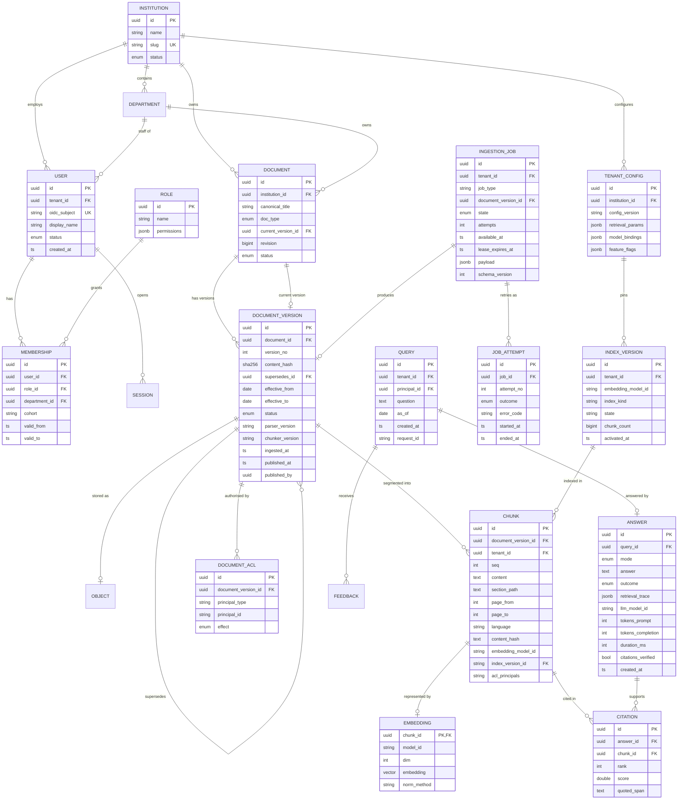
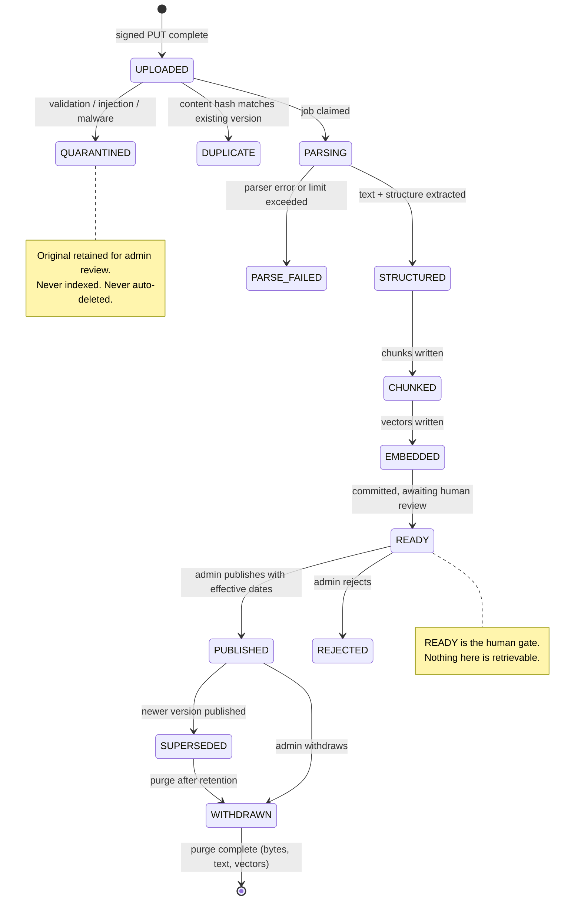

# §16 Data Model

**Status: conceptual.** The physical schema (DDL, types, indexes, partitioning) is deliberately
deferred to Phase 3, because index choices depend on measured corpus statistics
([§4](03-scale-model.md)) and on the real corpus profile (`OQ-004`). What follows is the entity model,
the invariants, and the lifecycle — all of which must be stable before DDL is written.

**Design principle.** Every entity that describes *knowledge* is immutable and versioned; every entity
that describes *an interaction* is append-only; every entity that describes *configuration* is
explicitly versioned so that a historical answer can be reproduced.

---

## 16.1 ER diagram



---

## 16.2 Entity notes

### Knowledge entities (immutable, versioned)

| Entity | Why it exists | Invariants |
|---|---|---|
| `INSTITUTION` | The tenant boundary | `slug` unique; status gates all access |
| `DEPARTMENT` | Organisational scoping; ACL principal; document ownership | Belongs to exactly one institution |
| `DOCUMENT` | **Stable identity** across versions — the entity a citation refers to | `current_version_id` is the only mutable field (+ `revision` for optimistic locking) |
| `DOCUMENT_VERSION` | An immutable point-in-time version | **Never updated after publication.** Unique `(document_id, version_no)`; unique `content_hash` per document (idempotency) |
| `CHUNK` | The retrieval unit | Immutable once written. Carries provenance + ACL. Deterministic `id` derived from `(version_id, chunker_version, seq)` so replay reproduces it |
| `EMBEDDING` | Separated so a model change rewrites vectors without touching text | 1:1 with chunk; `model_id` must match the active `INDEX_VERSION` |
| `DOCUMENT_ACL` | Authoritative ACL source | `acl_principals` on `CHUNK` is a **denormalised projection** of this, refreshed on change |
| `OBJECT` | The raw original bytes | Keyed `tenant/doc/version/uuid`; never keyed by user-supplied filename |

**The separation of `CHUNK` from `EMBEDDING` is the single most useful structural decision in the data
model.** It means a re-embedding campaign (new model, new dimension) rewrites only the vector rows; the
expensive parse output is untouched; chunk IDs are stable, so citations recorded before the re-embed
remain resolvable. Splitting these into one wide table would make a model upgrade a full rebuild.

### Interaction entities (append-only)

| Entity | Why it exists | Retention |
|---|---|---|
| `QUERY` | The user's question and the as-of context | 90 days `ESTIMATE`, configurable |
| `ANSWER` | The audit record: what was told, to whom, from what, with which model and trace | Same as query; required for UC-10 |
| `CITATION` | The link from claim to chunk + the quoted span | With answer |
| `FEEDBACK` | Thumbs up/down, "this is outdated" — the cheapest quality signal available | Indefinite, aggregated |

`ANSWER.retrieval_trace` stores candidate IDs, scores, filters applied and the index version. This is
what makes a support ticket debuggable and a quality regression diagnosable after the fact.

### Operational entities

| Entity | Why it exists | Invariants |
|---|---|---|
| `INGESTION_JOB` | Durable work; backpressure; DLQ | `attempts` capped; `available_at` implements backoff; `lease_expires_at` implements at-least-once; `schema_version` for forward compatibility |
| `JOB_ATTEMPT` | Why a job failed, and how often | Append-only; the DLQ's diagnostic value lives here |
| `INDEX_VERSION` | Which model/index generation is live | One `active` per tenant; the atomic switch target |

### Identity and authorisation entities

| Entity | Why | Invariant |
|---|---|---|
| `USER` | Local identity linked to the IdP's `subject` | `(tenant_id, oidc_subject)` unique; **no local password storage** |
| `ROLE` + `MEMBERSHIP` | RBAC base, with time-bounded validity for cohort/term-scoped roles | `valid_from`/`valid_to` support cohort roles that expire at term end |
| `SESSION` | Conversational continuity | Server-side; scoped to principal; expires |
| `TENANT_CONFIG` | Per-tenant models, chunking, retrieval depth, feature flags | Versioned (`config_version`) so a historical answer can be explained |

---

## 16.3 Relationships and cardinality

| Relationship | Cardinality | Note |
|---|---|---|
| Institution → Department → Document | 1:N:N | A document may be co-owned; modelled as one owning department plus ACLs for visibility |
| Document → DocumentVersion | 1:N | Ordered, immutable, one active |
| DocumentVersion → DocumentVersion (supersedes) | N:1 chain | **Cycle detection at publish time**; no open-ended superseded versions |
| DocumentVersion → Chunk | 1:N | Deterministic count per `chunker_version` |
| Chunk → Embedding | 1:1 | Only for the active index version |
| DocumentVersion → DocumentAcl | 1:N | The authoritative permission set |
| Query → Answer | 1:1 | One answer per query (refinements create new queries) |
| Answer → Citation → Chunk | 1:N | Citations must resolve; a dangling citation is a defect |
| IngestionJob → DocumentVersion | N:1 | Multiple jobs (retries, reindex) per version |
| IndexVersion → Chunk | 1:N | Active generation only |

---

## 16.4 Lifecycle

### Document lifecycle



### Embedding lifecycle

```
Chunk committed → queued for embedding → batched → vector written
    → ACTIVE (visible to retrieval for the active INDEX_VERSION)

On model change: new INDEX_VERSION created (state=BUILDING)
    → all chunks re-embedded in background
    → shadow index built
    → verification (count parity, recall sample)
    → ATOMIC SWITCH: index_version_id updated in one transaction
    → old generation retained for N days (rollback), then dropped
```

### Query and answer lifecycle

```
QUERY received → normalised → retrieval → answer generated or abstained
    → ANSWER persisted (immutable)
    → CITATION rows persisted
    → feedback may be attached later (mutable, on QUERY)
    → retention job deletes at expiry (answer content), keeping audit metadata
```

---

## 16.5 Data integrity invariants (testable)

These are the rules that, if violated, mean a real bug. Each is a test.

| ID | Invariant | Enforced by |
|---|---|---|
| DI-01 | A published `DOCUMENT_VERSION` is never updated | DB trigger + no UPDATE grant |
| DI-02 | `(document_id, version_no)` unique | Unique constraint |
| DI-03 | `content_hash` unique per document | Unique constraint → idempotency |
| DI-04 | A superseded version has a non-null `effective_to` | Application validation + check constraint |
| DI-05 | Supersession graph is acyclic | Publish-time cycle detection + test |
| DI-06 | `effective_from < effective_to` | Check constraint |
| DI-07 | Exactly one active `INDEX_VERSION` per tenant | Partial unique index |
| DI-08 | Every chunk's `embedding_model_id` equals its `index_version_id`'s model | Reconciliation job + test |
| DI-09 | Every citation resolves to an existing chunk the principal was authorised to read | FK + verification step |
| DI-10 | `chunk.id` is deterministic from `(version_id, chunker_version, seq)` | Test: replay reproduces IDs |
| DI-11 | Every job's `attempts ≤ max_attempts` | Application + DLQ transition |
| DI-12 | `chunk.tenant_id == document_version.tenant_id == institution` | FK chain + test |
| DI-13 | `acl_principals` on every chunk matches the projection of `DOCUMENT_ACL` | Reconciliation job, alert on drift |
| DI-14 | No query or answer row is readable cross-tenant | RLS + negative test suite |
| DI-15 | Purge removes chunk + embedding + object atomically-or-blocked | Transaction + test |

**DI-13 deserves a note.** `acl_principals` is a denormalisation for filter performance. Denormalised
authorisation data is a classic source of silent privilege loss when a refresh fails. It therefore gets
a **reconciliation job with an alert**, not just a write path. This is the kind of detail that separates
a design that works in a demo from one that works in production.

---

## 16.6 Partitioning and sharding strategy

| Table | Partition key | Rationale |
|---|---|---|
| `chunk` | `tenant_id` (hash) + time (monthly on `created_at`) | Tenant isolation in storage; old versions pruned by dropping partitions |
| `embedding` | Joins `chunk`; physically co-located | Avoids cross-partition lookups |
| `citation` | `tenant_id` | Retention by partition drop |
| `query`, `answer` | `tenant_id` + month | Same |
| `ingestion_job` | `state` (partial index on claimable rows) | Claim queries touch only pending rows |
| `document_version`, `document` | Unpartitioned at 2 M rows | Partitioning a small table costs more than it saves |
| audit tables | Monthly | Append-only; drop is a truncate-equivalent |

**Why hash on `tenant_id`:** a tenant's data stays physically co-located, so tenant-level export,
tenant-level deletion and tenant-level backup become bounded operations — which is exactly what
multi-tenancy needs operationally.

**The 10⁸-chunk escalation** ([§4](03-scale-model.md#40-reconciling-the-briefs-scale-target-with-reality)):
when the stress case exceeds one instance's comfortable operating point, partition by
`hash(tenant_id)` across Postgres instances, and route tenants to shards. Retrieval queries for a single
tenant are then single-shard — no scatter-gather — because **every query is tenant-scoped by
construction**. That property is why single-engine tenancy is a scaling advantage, not a limitation, at
this scale.

---

## 16.7 What is deliberately not modelled

| Not modelled | Reason |
|---|---|
| Vector collections / namespaces as first-class entities | Implicit in `INDEX_VERSION` + `tenant_id`. A separate entity adds a concept without a behaviour |
| Embedding model registry as a table | Config, not data. Pinned in version-controlled config so index provenance is reproducible |
| Prompt templates as rows | Versioned in the repository with the code. A prompt is a code artefact; storing it in the DB creates a second source of truth and makes prompt changes unreviewable |
| Cached answers as an entity | The cache is a cache. Making it durable would create a correctness problem (stale answers) in exchange for a hit-rate gain |
| Document relationships / knowledge graph | Rejected in [T18](10-rag-architecture-options.md#111-technique-assessment). If ever needed, add then |
| Per-chunk ACL history | ACL changes are rare and the *current* ACL governs retrieval. Historical ACL is captured in the audit log, which is the correct place for it |

The prompt-template decision is worth stating: prompts live in version control beside the code that
uses them, so that a prompt change is reviewed, diffable, and revertible as a single commit. Storing
prompts in the database would let someone change generation behaviour without a code review — which is
precisely the change most likely to break a grounding guarantee.